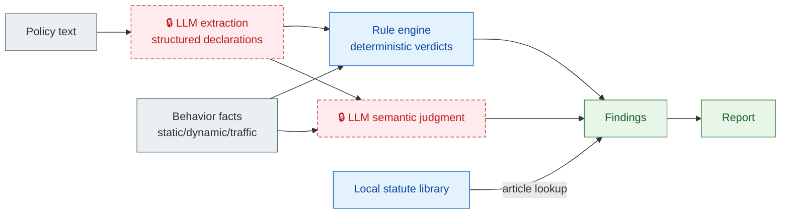
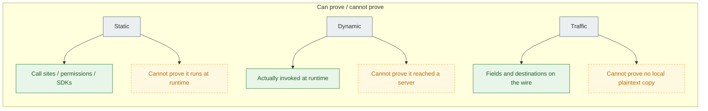
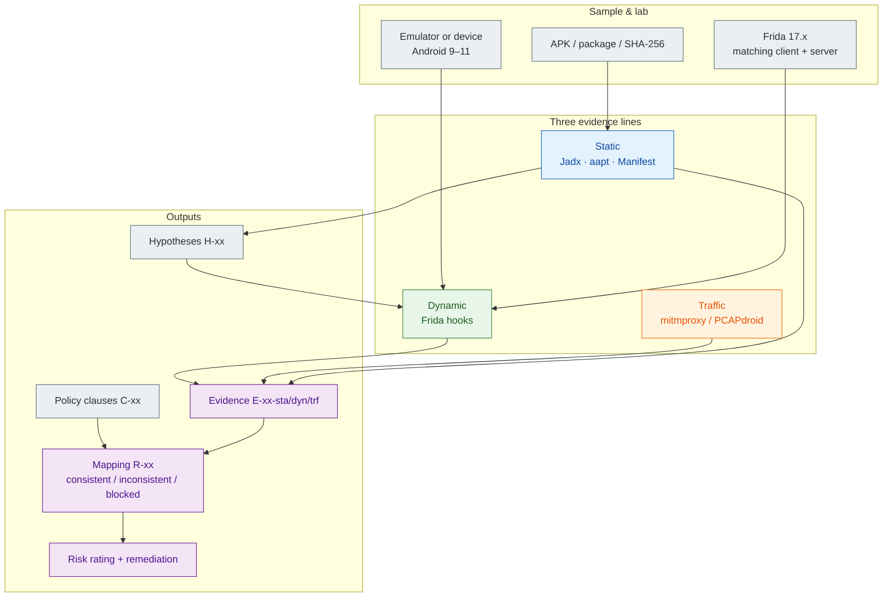
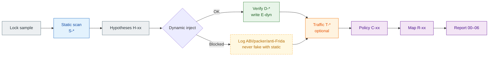
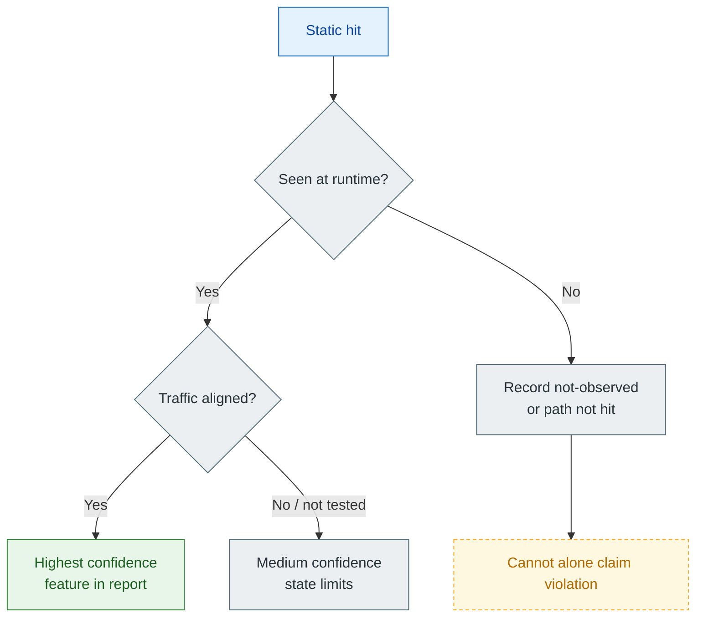
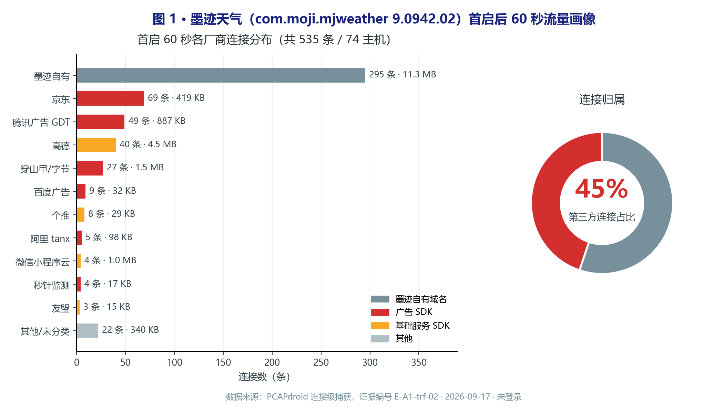
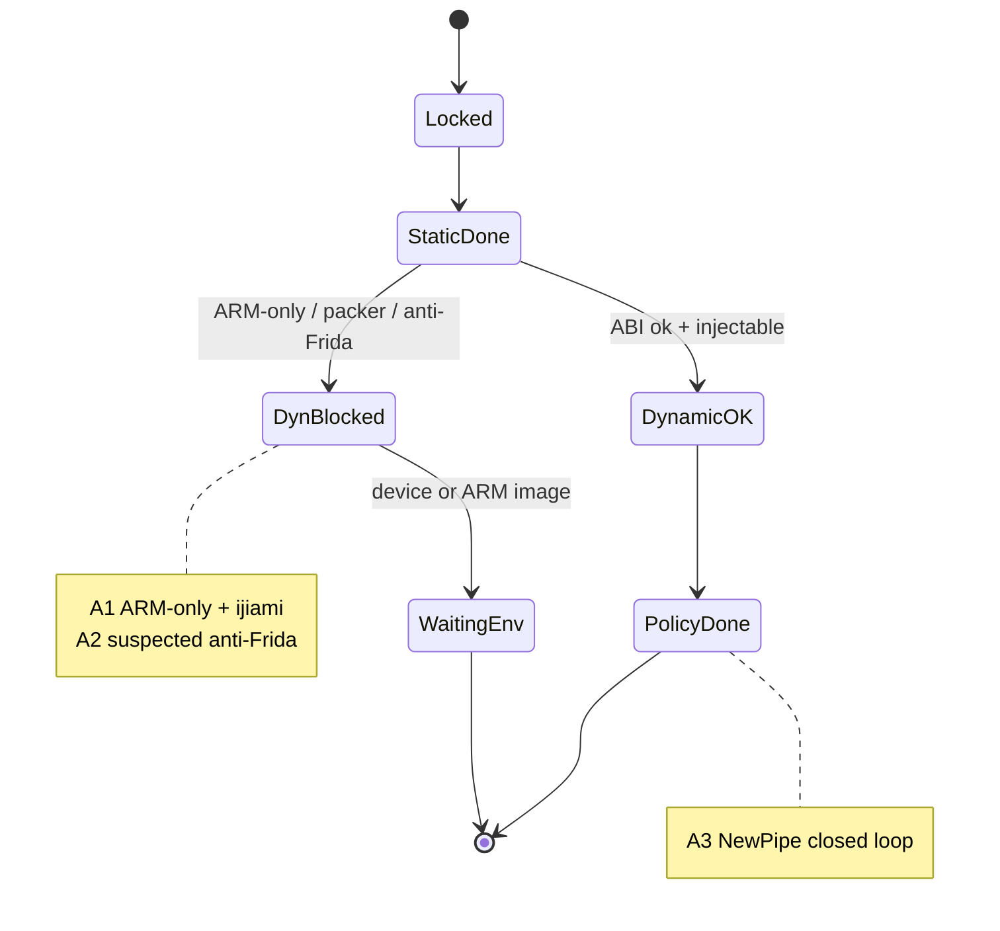

# App Privacy Audit

**English** | [简体中文](README.md)

> A hands-on Android privacy audit: static reverse engineering + Frida hooks + traffic capture + an LLM compliance engine that is not allowed to hallucinate.
> Every claim carries an evidence ID; every blocker is documented; zero invented statutes.

[](https://github.com/ConradLu2740/app-privacy-audit)
[](https://github.com/ConradLu2740/app-privacy-audit/actions/workflows/ci.yml)
[](https://frida.re)
[-3DDC84)](https://developer.android.com)
[](LICENSE)

---

## What this repo is

In one sentence: **I took three real apps, verified separately what their code *can* do and what they *actually do* at runtime, and published the whole process.**

If you have done mobile privacy work, you know how easy it is to fool yourself:

- A static search surfaces a dozen `getDeviceId` calls — scary, but **was any of them actually invoked?**
- Commercial APKs are packed; the emulator crashes on launch
- Frida attaches for a second, then the process kills itself
- A report claims "illegal collection" and has nothing to show when asked "prove it"

This repo splits the work into three evidence lines and **only writes a conclusion when they cross-check**:

| Line | Question | Tools |
|------|----------|-------|
| Static | Does the code path **exist**? | Jadx, aapt, keyword scanner |
| Dynamic | Was it **actually called**? | Frida hooks |
| Traffic | Did data **leave the device**? | PCAPdroid / mitmproxy |
| Policy | Were users **told**? | LLM extraction + manual review |

When a line fails, it fails openly. Injection failure, packer crash, anti-debug — all recorded as **blocked**, with reasons. A blocker is a result, not an embarrassment, and it makes a better story than a fake success.

Origin: enterprise challenge brief from the 9th Zhejiang Provincial College Student Network & Information Security Contest (Zhejiang Institute of Quality Science). This repo is **not a contest submission** — it is a personal portfolio.

**Who this is for**: security students (a workflow you can copy), developers building a portfolio (real blockers beat fake smoothness), peers who want to reproduce (scripts, checklist, full report).

---

## LLM compliance engine

`audit/` is a runnable pipeline that automates the three-way mapping — **policy declarations ↔ observed behavior ↔ statute articles**:



> 🔒 Red dashed nodes = LLM stages governed by the three anti-hallucination gates:
> declarations must carry verbatim quotes; article numbers and violation types come only from local deterministic stages.

The obvious question: what about LLM hallucination? The engine answers with three gates — **the LLM only does semantic understanding; it can never produce facts or statutes**:

1. **Quote verification**: every extracted declaration must carry a verbatim quote from the policy; code does substring matching and drops failures with a counter. Fabricated policy content cannot pass by design.
2. **Article status**: statutes not verified against their source text are excluded from verdicts unless explicitly allowed — "check before citing" enforced in code.
3. **Non-empty evidence**: a finding without evidence IDs is rejected at construction; it cannot exist in the architecture.

Article numbers come from the local library only; violation types come from a closed enum. The model has nothing to invent.

**Verify offline** (no network, no API key):

```bash
pip install -r requirements.txt
python -m audit smoke        # end-to-end smoke, artifacts in out/
python -m pytest tests/ -v   # 21 tests: three gates + rule engine
python evals/run_eval.py     # 6 eval cases: P/R/F1 + anti-hallucination gates, all green
```

Details: [audit/README.md](audit/README.md) · Design: [docs/design/llm-compliance-engine.md](docs/design/llm-compliance-engine.md)

---

## Method: how the three lines cross-check

First, what each line **can and cannot prove** — this is the evidence discipline of the whole repo:



### Architecture



### Pipeline



### Confidence levels



Ground rules:

- A static hit is a **hypothesis**, never a violation verdict
- "Not observed" ≠ "does not exist" — always state the observation window
- Blocked is blocked; **never substitute static results for dynamic**
- Evidence IDs: `E-<sample>-sta/dyn/trf/pol-nn`; reports cite IDs only

Details: [docs/methodology.md](docs/methodology.md) · Checklist: [checklists/privacy-checklist.md](checklists/privacy-checklist.md)

---

## Samples (locked 2026-09-14)

Two commercial apps plus one open-source control:

| ID | App | Package | Version | Why | Dynamic |
|----|-----|---------|---------|-----|---------|
| **A1** | Moji Weather | `com.moji.mjweather` | 9.0942.02 | Weather needs location by nature; heavy commercial SDK surface | Blocked |
| **A2** | Douban | `com.douban.frodo` | 7.133.0 | Content community; readable policy; pairs with A1 | Blocked |
| **A3** | [NewPipe](https://github.com/TeamNewPipe/NewPipe) | `org.schabi.newpipe` | 0.29.1 | Open source, unpacked, x86_64 — **the dynamic control** | OK |

A1/A2 are the commercial deep-dives plus engineering blockers; A3 proves the whole pipeline works in this lab.

Hashes and channels: [docs/report/01-samples.md](docs/report/01-samples.md). **APKs are not in this repo** — fetch them from official channels.

---

## Results (honest)

| Sample | Static | Dynamic | Traffic | Policy map | One-liner |
|--------|--------|---------|---------|------------|-----------|
| A1 Moji | ✅ | ❌ Blocked (ARM-only + ijiami shell crashes on x86_64 AVD) | ✅ 60s after first launch: 535 conns / 74 hosts, third-party SDKs confirmed live, 50 plaintext HTTP | ✅ | Huge permission/SDK surface; OAID in 323 files; third-party sharing confirmed on the wire; plaintext log endpoints |
| A2 Douban | ✅ | ❌ Likely anti-Frida (process dies on attach — 网易易盾 NIS) | ✅ Own domains only in 60s | ✅ | Custom deviceId + clipboard-heavy code; commercial SDKs silent in an unlogged 60s session |
| A3 NewPipe | ✅ | ✅ Alive through the 30s playbook, zero business hits | ✅ Only `www.youtube.com` | ✅ | Minimal permissions; behavior matches the GDPR policy — the textbook control |

About those two "blocked" cells: A1 is an ABI mismatch plus the ijiami packer; A2 is anti-injection. In the same lab, NewPipe and a calculator app hook fine — so it is the samples' defenses, not the scripts. Most reports quietly skip these failures; here they are on record.



*Figure 1: connection distribution by vendor. Ad SDKs (red) total 159 connections, 45% of all traffic; "Moji-owned" includes 50 plaintext HTTP log endpoints (F-10). Source: E-A1-trf-02.*

### Top findings

| ID | Sample | Level | Finding | Evidence |
|----|--------|-------|---------|----------|
| F-01 | A1 | Medium | Background location + silent device-info collection; disclosed but broad | E-A1-sta-01 · E-A1-pol-01 |
| F-02 | A1 | Medium | OAID/device-ID system spanning 323 files; several SDKs never named individually | E-A1-sta-01 · E-A1-pol-01 |
| F-04 | A1 | Medium | JD / GDT / Pangle / AMap / Baidu / Getui / Umeng all went online within 60s of first launch | E-A1-trf-02 |
| F-05 | A2 | Low | `QUERY_ALL_PACKAGES` disclosed, but the stated scope ("app jumping") is narrower than reality | E-A2-sta-01 · E-A2-pol-01 |
| F-06 | A2 | Low | Clipboard "local-only" claim still awaits dynamic verification | E-A2-sta-01 · E-A2-pol-01 |
| F-09 | A3 | None | Narrow permissions + YouTube-only traffic, consistent with policy | E-A3-sta-01 · E-A3-dyn-02 · E-A3-trf-01 |
| F-10 | A1 | Medium | 50 plaintext HTTP connections to first-party log endpoints (`v1.log.moji.com`, etc.) | E-A1-trf-02 |

Full table (F-01…F-10) with remediation: [docs/report/06-findings-and-fixes.md](docs/report/06-findings-and-fixes.md).



**A3 dynamic playbook (follow along to reproduce)**

1. `pm clear`, cold start `MainActivity`
2. After ~1s: `frida -U -p <pid> -l scripts/frida/all_hooks.js` (attach, don't spawn)
3. Tap tabs, scroll lists, open items for ~30s
4. Process stays alive; the hook log shows no IMEI / ANDROID_ID / location hits

Evidence under `evidence/org.schabi.newpipe/`. Full report, six chapters:

| Chapter | File |
|---------|------|
| Samples | [01](docs/report/01-samples.md) |
| Static | [02](docs/report/02-static-analysis.md) |
| Dynamic | [03](docs/report/03-dynamic-analysis.md) |
| Traffic | [04](docs/report/04-traffic-analysis.md) |
| Compliance | [05](docs/report/05-compliance-review.md) |
| Findings | [06](docs/report/06-findings-and-fixes.md) |

> Report chapters are in Chinese; this file is the English entry point.

---

## 5-minute reproduce (A3 dynamic)

You need: Android SDK (adb + emulator) or a rooted device, Python 3.10+, and network access to fetch an APK.

**1. Install Frida**

```bash
pip install frida-tools
frida --version    # note the version, e.g. 17.18.0
```

**2. Start an emulator**

Create an API 30 / x86_64 AVD (validated image: `google_apis;x86_64`).

```bash
adb devices
adb root
```

**3. Push frida-server**

Grab the **same version** `frida-server-<ver>-android-x86_64.xz` from [Frida Releases](https://github.com/frida/frida/releases):

```bash
adb push frida-server /data/local/tmp/
adb shell chmod 755 /data/local/tmp/frida-server
adb shell "/data/local/tmp/frida-server -D &"
frida-ps -U | head
```

**4. Install NewPipe**

From [F-Droid](https://f-droid.org/packages/org.schabi.newpipe/) or GitHub Releases:

```bash
adb install -r NewPipe.apk
```

**5. Hook**

```bash
adb shell am start -n org.schabi.newpipe/.MainActivity
adb shell pidof org.schabi.newpipe
frida -U -p <pid> -l scripts/frida/all_hooks.js   # Frida 17: no --no-pause
```

You should see `[HOOK][all] combined hooks ready`. Interact with the app; any
`[HOOK][...] method() -> ...` line is a runtime hit.

**6. Archive evidence (optional)**

Follow [evidence/README.md](evidence/README.md); redact tokens and phone numbers.

Lab notes from validation: [docs/environment.md](docs/environment.md) (Chinese).

---

## Validated lab (reference)

| Item | Value |
|------|-------|
| OS | Windows 11 |
| Emulator | AVD `privacy-api30`, Android 11 (API 30) x86_64 |
| Frida | client + server 17.18.0 |
| Jadx | 1.5.1 |
| Date | 2026-09-14 |

Paths may differ on your machine. The only success criterion: **Frida lists processes and A3 attaches without dying**.

---

## Repository layout

```text
app-privacy-audit/
├── README.md                 ← Chinese (GitHub default)
├── README.en.md              ← English
├── HANDOFF.md                ← status & how to resume
├── LICENSE
├── audit/                    ← LLM compliance engine (runnable pipeline)
│   ├── llm/                  #   provider abstraction
│   ├── policy/               #   policy → structured declarations
│   ├── regulation/           #   local statute library
│   ├── align/                #   declaration-behavior alignment
│   └── report/               #   report generation
├── fixtures/                 # fixed data for smoke & tests
├── tests/                    # 21 unit tests
├── evals/                    # engine eval set (6 cases incl. anti-hallucination gate)
├── config.example.yaml
├── docs/
│   ├── design/               # engine design docs
│   ├── methodology.md
│   ├── compliance.md
│   ├── environment.md
│   ├── sample-candidates.md
│   └── report/               # chapters 00–06 (Chinese)
├── checklists/
│   └── privacy-checklist.md
├── scripts/
│   ├── frida/                # device_id / location / all_hooks etc.
│   └── static/               # static keyword scanner scan.py
├── evidence/                 # redacted evidence, per package
└── assets/
```

---

## FAQ

**Why no dynamic data for A1/A2 — is the script broken?**
No. NewPipe and a calculator app hook fine in the same lab. A1 is ABI/packer, A2 looks like anti-injection. The samples' defenses, not the scripts. See the "blocked" sections in the dynamic report.

**Can a static `getDeviceId` hit support a violation claim?**
No. Static shows a code path exists. A verdict needs runtime timing + policy text + legal elements.

**Can I scan other apps with this?**
Method and scripts: yes. Only on devices you own, against publicly distributed apps, within local law and the app's terms. Never commit APKs, raw PCAPs, or other people's data.

**Does the engine send data to third parties?**
Only the privacy policy text goes to the configured LLM service for extraction — policy documents are public compliance material. No payloads, no personal data, no APKs. Credentials come from env vars or a local `config.yaml`, both gitignored. For a fully offline run, point the provider at a local OpenAI-compatible server; no code changes needed.

**Where do I start with the traffic line?**
[docs/report/04-traffic-analysis.md](docs/report/04-traffic-analysis.md) and [scripts/traffic/README.md](scripts/traffic/README.md). Mind Android 7+ user CAs and SSL pinning.

---

## Disclaimers

- For security research, compliance learning, and teaching only
- No full APKs; no raw privacy-bearing captures in git
- Limited versions and observation windows; "not observed" is not a legal finding of "does not exist"
- Verify any statute text before citing

## License

[MIT](LICENSE) — Issues/PRs welcome for checklists and scripts; please do not submit sample binaries.

If this repo helps you, a star keeps the traffic line and more samples coming.
