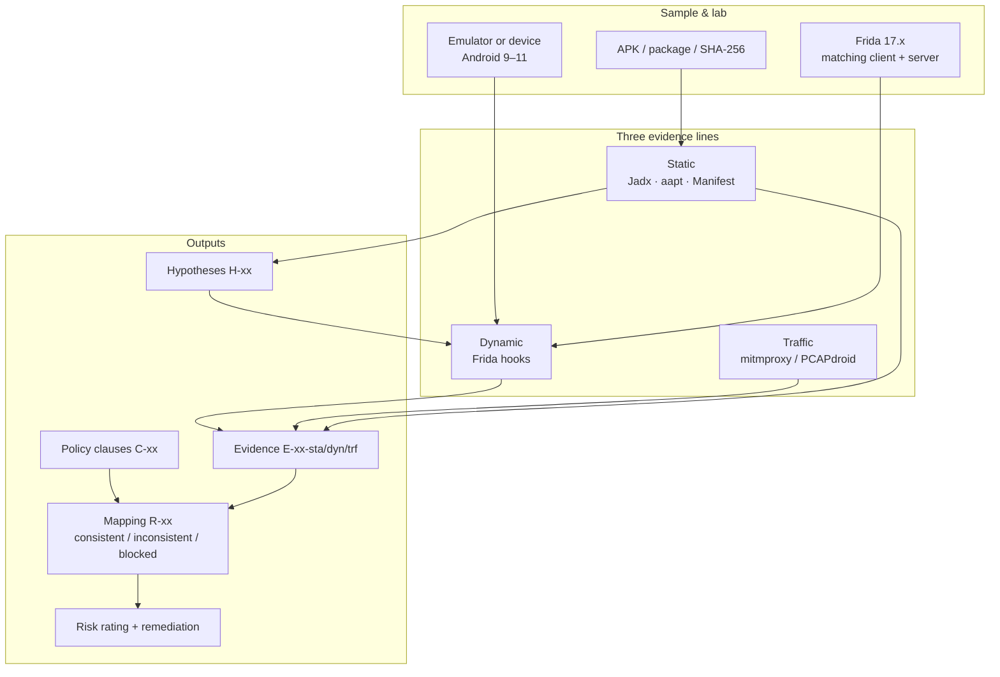
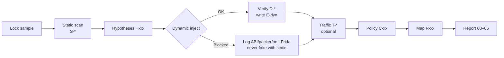
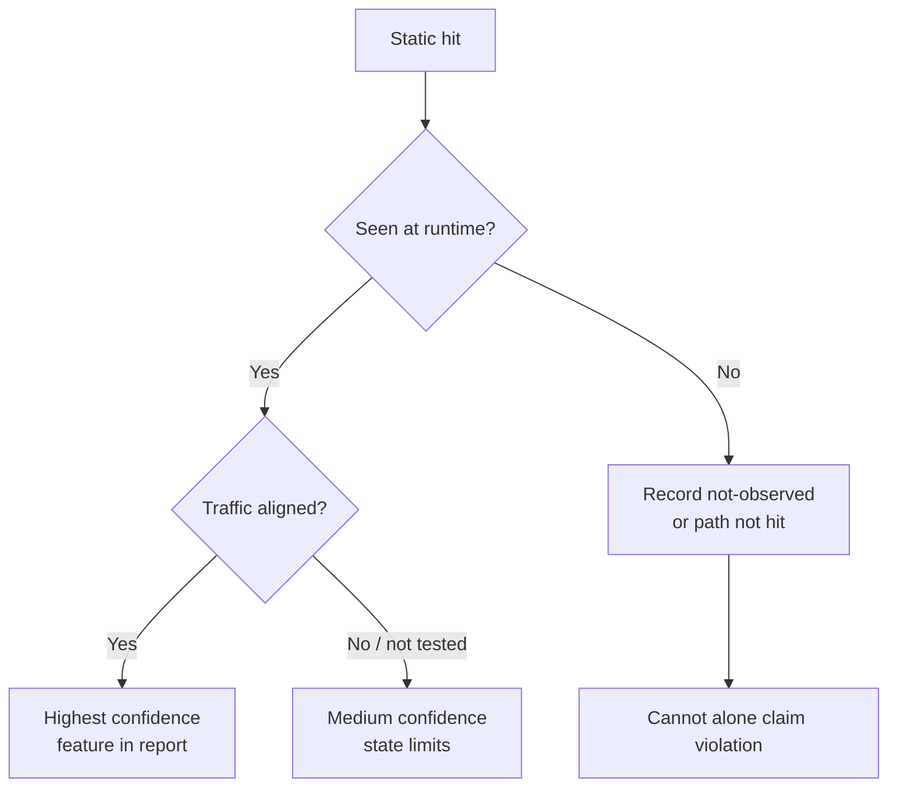
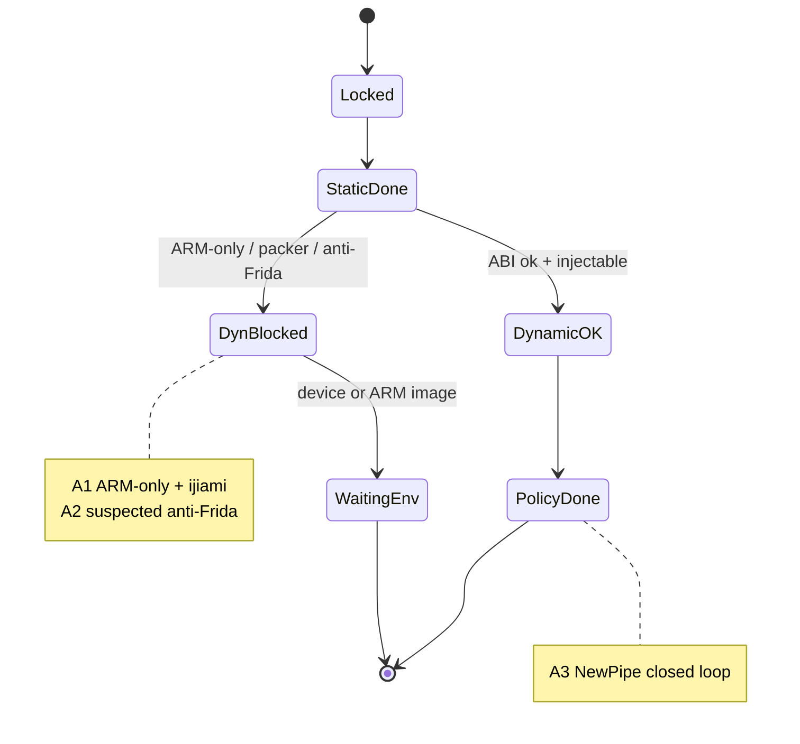

# App Privacy Audit

**English** | [简体中文](README.zh-CN.md)

> A solo-friendly, reproducible **Android app privacy audit** lab.  
> Static reverse engineering + dynamic Frida hooks + policy mapping — with honest blockers, not marketing claims.

[](https://github.com/ConradLu2740/app-privacy-audit)
[](https://frida.re)
[-3DDC84)](https://developer.android.com)
[](LICENSE)

---

## Why this repo exists

If you have audited mobile privacy before, some of this will sound familiar:

- Static search finds dozens of `getDeviceId` sites — **but does the app actually call them at runtime?**
- A commercial APK is packed; the emulator crashes on launch
- Frida attaches for one second, then the process kills itself (anti-injection)
- A report shouts “illegal collection” without reproducible evidence

This project separates **“code path exists”** from **“runtime behavior observed”** using three evidence lines, and **records failures as first-class results**.

Topic origin: enterprise challenge brief from the 9th Zhejiang Provincial College Student Network & Information Security Contest (Zhejiang Institute of Quality Science). This repo is **not a contest submission** — it is maintained as a personal portfolio / learning artifact.

**Who this is for**

| You are | What you get |
|---------|----------------|
| Security / privacy student | A reusable workflow + evidence ID scheme |
| Developer building a portfolio | Real samples, real blockers, a story you can tell |
| Peer who wants to reproduce | Env steps, scripts, checklist, report skeleton |

---

## Problem space

Typical mobile privacy issues:

1. **Over-broad permissions** — location / contacts / phone state unrelated to the feature  
2. **Policy vs practice gap** — “we do not collect” in text, SDKs still collect  
3. **Weak transport / storage** — cleartext HTTP, sensitive fields in logs  

Decompilation alone over-reports; packet capture alone under-reports; policy text alone proves nothing.  
So the method is fixed: **static → dynamic → policy**. Only cross-checked items become “consistent / inconsistent”; everything else is “blocked / needs review”.

---

## Method (three evidence lines)

### Architecture



### Standard pipeline



### Cross-checking evidence



**Conventions**

- Static hits create **hypotheses only** — not violation verdicts  
- “Not observed” ≠ “does not exist”; always state the observation window  
- Injection failure, packer crash, anti-debug → status **blocked**; never substitute static for dynamic  
- Evidence IDs: `E-<sample>-sta/dyn/trf/pol-nn`

Details: [docs/methodology.md](docs/methodology.md) · Checklist: [checklists/privacy-checklist.md](checklists/privacy-checklist.md)

---

## Samples (locked 2026-09-14)

| ID | App | Package | Version | Why | Dynamic |
|----|-----|---------|---------|-----|---------|
| **A1** | Moji Weather | `com.moji.mjweather` | 9.0942.02 | Weather = location-centric; large commercial SDK surface | Blocked |
| **A2** | Douban | `com.douban.frodo` | 7.133.0 | Content community; readable policy; pair with A1 | Blocked |
| **A3** | [NewPipe](https://github.com/TeamNewPipe/NewPipe) | `org.schabi.newpipe` | 0.29.1 | Open source, unpacked, x86_64 — **dynamic control** | OK |

Roles:

- **A1 / A2** — deep static on commercial apps + engineering blockers  
- **A3** — proves the dynamic/compliance path works here; low-collection baseline  

Hashes and channels: [docs/report/01-samples.md](docs/report/01-samples.md).  
**APKs are not in this repo** — download from official channels yourself.

---

## Results (honest)

| Sample | Static | Dynamic | Policy map | One-liner |
|--------|--------|---------|------------|-----------|
| A1 Moji | Done | **Blocked** (ARM-only + ijiami shell crashes on x86_64 AVD) | Not done | Large permission/SDK surface; runtime not verifiable here |
| A2 Douban | Done | **Blocked** (likely anti-Frida; process dies on attach) | Not done | Own deviceId + clipboard-heavy code; needs weaker adversary lab |
| A3 NewPipe | Done | **Done** | **Done** | Minimal permissions; no ID/location hits in 30s playbook; aligns with policy |

Sample pipeline:



**A3 dynamic playbook (reproducible)**

1. `pm clear` → cold start `MainActivity`  
2. After ~1s: `frida -U -p <pid> -l scripts/frida/all_hooks.js`  
3. Tap bottom tabs, scroll, open an item (~30s)  
4. Process stays alive; no IMEI / ANDROID_ID / location business hits in the hook log  

Evidence under `evidence/org.schabi.newpipe/`.

| Chapter | File |
|---------|------|
| Samples | [docs/report/01-samples.md](docs/report/01-samples.md) |
| Static | [docs/report/02-static-analysis.md](docs/report/02-static-analysis.md) |
| Dynamic | [docs/report/03-dynamic-analysis.md](docs/report/03-dynamic-analysis.md) |
| Traffic | [docs/report/04-traffic-analysis.md](docs/report/04-traffic-analysis.md) (skeleton) |
| Compliance | [docs/report/05-compliance-review.md](docs/report/05-compliance-review.md) |
| Findings | [docs/report/06-findings-and-fixes.md](docs/report/06-findings-and-fixes.md) (skeleton) |

> Report body text is currently Chinese; methodology and this README are the English entry points.

---

## 5-minute reproduce (A3 dynamic)

### You need

- Windows / macOS / Linux  
- Android SDK (`adb` + emulator) or a rooted device  
- Python 3.10+  
- Network to fetch an APK  

### Steps

**1. Install Frida**

```bash
pip install frida-tools
frida --version   # note the version, e.g. 17.18.0
```

**2. Start an emulator**

Create an **API 30 / x86_64** AVD (validated image: `google_apis;x86_64`).

```bash
adb devices
adb root
```

**3. Push and start frida-server**

Download the **same version** `frida-server-<ver>-android-x86_64.xz` from [Frida Releases](https://github.com/frida/frida/releases):

```bash
adb push frida-server /data/local/tmp/
adb shell chmod 755 /data/local/tmp/frida-server
adb shell "/data/local/tmp/frida-server -D &"
frida-ps -U | head
```

**4. Install NewPipe**

Get the APK from [F-Droid](https://f-droid.org/packages/org.schabi.newpipe/) or GitHub Releases:

```bash
adb install -r NewPipe.apk
```

**5. Hook**

```bash
adb shell am start -n org.schabi.newpipe/.MainActivity
adb shell pidof org.schabi.newpipe

# Frida 17: do not pass --no-pause
frida -U -p <pid> -l scripts/frida/all_hooks.js
```

You should see:

```text
[HOOK][all] installing combined hooks...
[HOOK][device] hooked android.telephony.TelephonyManager.getDeviceId
...
[HOOK][all] combined hooks ready
```

Interact with the app; `[HOOK][...] method() -> ...` lines are runtime hits.

**6. Archive evidence (optional)**

Follow [evidence/README.md](evidence/README.md); redact tokens and phone numbers.

Lab notes from validation: [docs/environment.md](docs/environment.md) (Chinese).

---

## Validated lab (reference)

| Item | Value |
|------|-------|
| OS | Windows 11 |
| Emulator | Android SDK Emulator, AVD `privacy-api30` |
| System | Android 11 (API 30), x86_64 |
| Frida | client + server 17.18.0 |
| Jadx | 1.5.1 |
| Date | 2026-09-14 |

Paths may differ on your machine. Success criterion: **Frida lists processes, A3 attaches without dying**.

---

## Repository layout

```text
app-privacy-audit/
├── README.md                 ← English (GitHub default)
├── README.zh-CN.md           ← Chinese
├── HANDOFF.md                ← status & how to resume
├── LICENSE
├── docs/
│   ├── methodology.md
│   ├── compliance.md
│   ├── environment.md
│   ├── sample-candidates.md
│   └── report/               # 00–06 chapters (Chinese)
├── checklists/
│   └── privacy-checklist.md
├── scripts/frida/
├── evidence/                 # redacted, per package
└── assets/
```

---

## FAQ

**Why no dynamic data for A1/A2 — is the script broken?**  
No. NewPipe and a calculator app inject fine in the same lab. A1 is ABI/packer; A2 looks like anti-injection. See the “blocked” sections in the dynamic report.

**Can I claim a violation from a static `getDeviceId` hit?**  
No. Static only shows a code path exists. You need runtime timing, policy text, and legal elements.

**Can I scan other apps with this?**  
Method and scripts: yes. Only on **devices you own**, against **publicly distributed** apps, within local law and the app’s terms. Never commit APKs, raw PCAPs, or third-party personal data.

**Next: traffic line?**  
Start from [docs/report/04-traffic-analysis.md](docs/report/04-traffic-analysis.md) and [scripts/traffic/README.md](scripts/traffic/README.md). Mind Android 7+ user CAs and SSL pinning.

---

## Disclaimers

- For security research, compliance learning, and teaching only.  
- No full APKs; no raw privacy-bearing captures in git.  
- Limited versions and observation windows; “not observed” is not a legal finding of “does not exist”.  
- Verify any statute text before citing.

---

## License

[MIT](LICENSE) — Issues/PRs welcome for checklists and scripts; please do not submit sample binaries.

Stars help motivate the traffic line and more samples.
