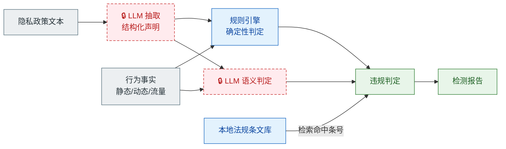
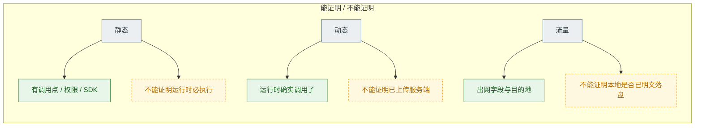
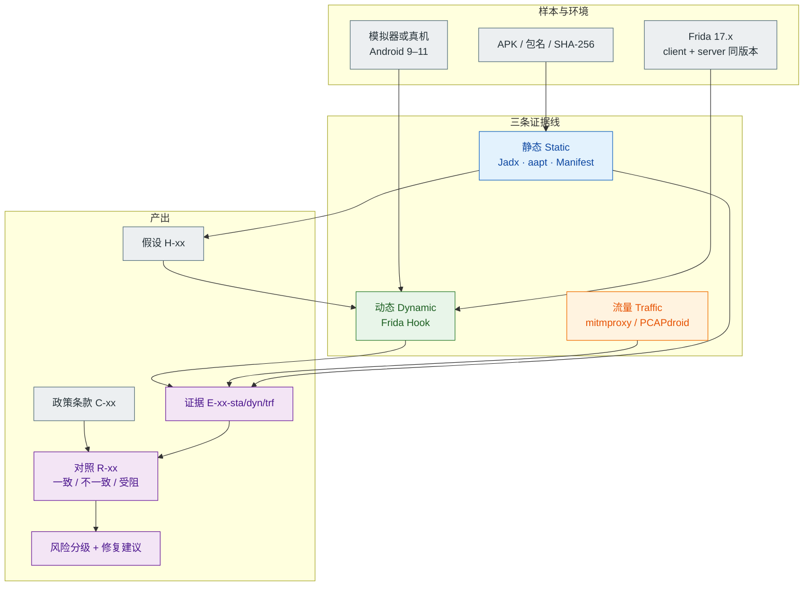
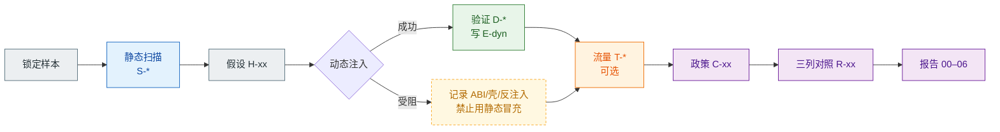
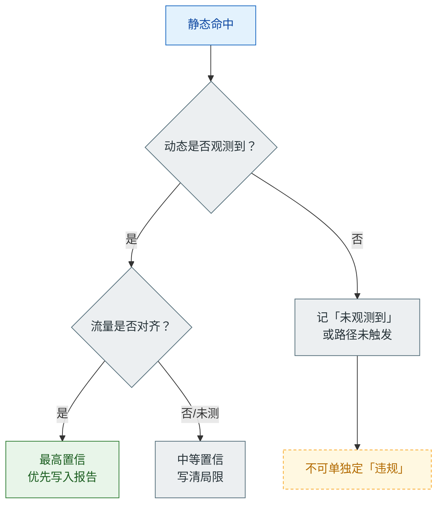
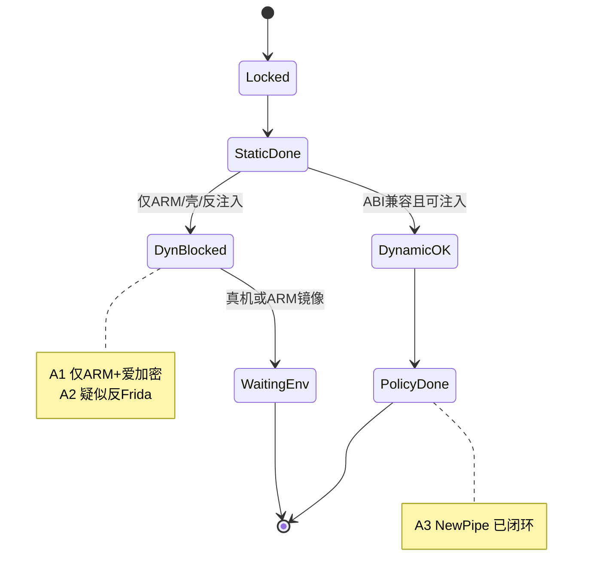

# App Privacy Audit

[English](README.en.md) | **简体中文**

> 一个 Android 隐私检测的完整实战仓库：静态逆向 + 动态 Hook + 流量分析 + LLM 合规研判。
> 每条结论都有证据编号，每次受阻都写明原因，法条引用零编造。

[](https://github.com/ConradLu2740/app-privacy-audit)
[](https://frida.re)
[-3DDC84)](https://developer.android.com)
[](LICENSE)

---

## 这个仓库是什么

一句话：**我拿三款真实的 App，把「代码里写了什么」和「运行时真做了什么」分开验证了一遍，并把全过程公开。**

做过 App 隐私分析的人都知道，这事最容易自欺：

- 反编译搜到一串 `getDeviceId`，看起来很吓人——但它运行时真的调用了吗？不知道。
- 商业 App 加了壳，模拟器上直接起不来；好不容易 Hook 上去，进程当场自杀。
- 报告里写「违规收集」， reviewer 一句「证据呢」就噎住了。

这个仓库的做法是把三条证据线分开跑，**只有交叉验证过的才下结论**：

| 线 | 回答的问题 | 工具 |
|----|-----------|------|
| 静态 | 代码里**有没有**这条路？ | Jadx、aapt、关键字扫描器 |
| 动态 | 运行时**调没调**？ | Frida Hook |
| 流量 | 数据**发没发出去**？ | PCAPdroid / mitmproxy |
| 政策 | 它**有没有告诉你**？ | LLM 结构化抽取 + 人工核对 |

跑不通的线不硬凑。注入失败、壳崩溃、反调试，一律记「受阻」并写清原因——**受阻本身就是结果**，这比假装跑通了诚实得多，也更有故事可讲。

选题来自第九届浙江省大学生网络与信息安全竞赛的企业命题（命题方：浙江省质量科学研究院）。仓库按个人作品集标准维护，**不参赛**。

**适合谁**：安全方向学生（可抄流程）、做作品集的开发者（真实受阻比一帆风顺可信）、想复现的同行（脚本、清单、报告全公开）。

---

## LLM 合规研判引擎

`audit/` 目录是一套能跑的流水线，把「政策声明 ↔ 实际行为 ↔ 法规条文」的三列对照从手工填表变成自动化环节：



> 🔒 红色虚线节点 = 三道防幻觉闸门管制的 LLM 环节：只产出带原文引证的声明，
> 条号与违规类型全部由本地确定性环节给出。

用 LLM 做合规分析，最大的质疑是幻觉。所以引擎加了三道闸门——**LLM 只负责理解语义，永远碰不到事实和法条的生成**：

1. **原文引证校验**：LLM 抽出的每条政策声明必须附原文片段，代码做子串匹配，对不上就直接丢弃并计入丢弃率。模型编不出政策里不存在的内容。
2. **条文核对状态**：法规库中没核对过原文的条目默认不参与判定，除非显式放行。相当于把「引用前核对」变成代码强制。
3. **证据非空约束**：没有证据编号的判定在构造时就被拒绝，架构上生不成。

另外，法条号全部由本地法规库检索得出，违规类型是闭集枚举——模型想编也编不了。

**离线即可验证**（不需要网络，不需要 API key）：

```bash
pip install -r requirements.txt
python -m audit smoke        # 端到端冒烟，产物写入 out/
python -m pytest tests/ -v   # 21 项测试：三道闸门 + 规则引擎
python evals/run_eval.py     # 6 个评测用例：判定 P/R/F1 + 防幻觉断言，全绿
```

细节见 [audit/README.md](audit/README.md)，设计文档在
[docs/design/llm-compliance-engine.md](docs/design/llm-compliance-engine.md)。

---

## 方法：三线怎么交叉

先声明每条线**能证明什么、不能证明什么**——这是全仓库的证据纪律：



### 架构



### 流程



### 置信度怎么定



几条铁律：

- 静态命中只是**假设**，永远不单独构成「违规」
- 动态「没观测到」≠「不存在」，必须写清操作窗口
- 受阻就记受阻，**禁止拿静态结论冒充动态结果**
- 所有证据统一编号 `E-<样本>-sta/dyn/trf/pol-nn`，报告只引用编号

流程细节见 [docs/methodology.md](docs/methodology.md)，逐项勾选清单见
[checklists/privacy-checklist.md](checklists/privacy-checklist.md)。

---

## 测了哪三款 App

样本 2026-09-14 锁定，两款商业 + 一款开源做对照：

| ID | 应用 | 包名 | 版本 | 为什么选它 | 动态 |
|----|------|------|------|------------|------|
| **A1** | 墨迹天气 | `com.moji.mjweather` | 9.0942.02 | 天气类天然要定位，商业 SDK 一大堆 | 受阻 |
| **A2** | 豆瓣 | `com.douban.frodo` | 7.133.0 | 内容社区，政策写得规整，能和 A1 横向比 | 受阻 |
| **A3** | [NewPipe](https://github.com/TeamNewPipe/NewPipe) | `org.schabi.newpipe` | 0.29.1 | 开源、无壳、有 x86_64 包——**动态方法的对照组** | 成功 |

分工：A1/A2 负责「真实商业样本的静态深挖 + 工程受阻实录」，A3 负责证明这套流程在本环境真的能跑通。

哈希、下载渠道、Jadx 文件数见 [docs/report/01-samples.md](docs/report/01-samples.md)。APK 不进仓库，请自行从官方渠道下载。

---

## 结果（诚实版）

| 样本 | 静态 | 动态 | 流量 | 政策对照 | 一句话结论 |
|------|------|------|------|----------|------------|
| A1 墨迹 | ✅ | ❌ 受阻（仅 ARM + 爱加密壳崩在 x86_64 AVD） | ✅ 首启 60s：535 连接 / 74 主机，第三方 SDK 全部实证联网，50 条明文 HTTP | ✅ | 权限和 SDK 面很大；OAID 命中 323 个文件；流量层坐实了第三方共享；日志端点走明文 |
| A2 豆瓣 | ✅ | ❌ 疑似反 Frida（attach 即死，网易易盾 NIS） | ✅ 60s 只见自有域名 | ✅ | 有自研 deviceId 和不少剪贴板代码；未登录场景下商业 SDK 没触发 |
| A3 NewPipe | ✅ | ✅ 30s 剧本全程存活，零业务命中 | ✅ 只连 `www.youtube.com` | ✅ | 权限极少，行为和 GDPR 政策对得上——教科书级的对照组 |

「受阻」那一列值得说两句：A1 是 ABI 不兼容 + 爱加密壳，A2 是反注入。同环境下 NewPipe 和一个计算器 App 都能正常 Hook，所以是样本的问题，不是脚本的问题。这类失败在大多数报告里会被悄悄略过，这里全部留档。


*图 1：墨迹天气首启后 60 秒的连接分布。广告类 SDK（红）合计 159 条连接，占全部连接的 45%；「墨迹自有」中含 50 条明文 HTTP 日志端点（F-10）。数据来源 E-A1-trf-02。*

### 主要发现

| ID | 样本 | 级别 | 结论 | 证据 |
|----|------|------|------|------|
| F-01 | A1 | 中 | 后台定位 + 静默收集设备信息，政策披露了但面太广 | E-A1-sta-01 · E-A1-pol-01 |
| F-02 | A1 | 中 | OAID/设备标识体系庞大（323 文件），多家第三方 SDK 没单独点名 | E-A1-sta-01 · E-A1-pol-01 |
| F-04 | A1 | 中 | 京东/GDT/穿山甲/高德/百度/个推/友盟，首启 60 秒内全部联网 | E-A1-trf-02 |
| F-05 | A2 | 低 | `QUERY_ALL_PACKAGES` 披露了，但范围写得比实际窄 | E-A2-sta-01 · E-A2-pol-01 |
| F-06 | A2 | 低 | 剪贴板「仅本地识别」的声明还没法动态验证 | E-A2-sta-01 · E-A2-pol-01 |
| F-09 | A3 | 无 | 权限极窄 + 流量只有 YouTube 官方域名，与政策一致 | E-A3-sta-01 · E-A3-dyn-02 · E-A3-trf-01 |
| F-10 | A1 | 中 | 50 条明文 HTTP 集中在自有日志端点（`v1.log.moji.com` 等） | E-A1-trf-02 |

完整风险表（F-01…F-10）与修复建议：[docs/report/06-findings-and-fixes.md](docs/report/06-findings-and-fixes.md)。



**A3 动态剧本（照着做就能复现）**

1. `pm clear` 后冷启动 `MainActivity`
2. 约 1 秒后 `frida -U -p <pid> -l scripts/frida/all_hooks.js`（attach，别 spawn）
3. 点 Tab、滚列表、进详情，折腾 30 秒
4. 进程全程存活，Hook 日志里没有任何 IMEI / ANDROID_ID / 定位命中

证据在 `evidence/org.schabi.newpipe/`。完整报告六章：

| 章节 | 文件 |
|------|------|
| 样本 | [01-samples](docs/report/01-samples.md) |
| 静态 | [02-static-analysis](docs/report/02-static-analysis.md) |
| 动态 | [03-dynamic-analysis](docs/report/03-dynamic-analysis.md) |
| 流量 | [04-traffic-analysis](docs/report/04-traffic-analysis.md) |
| 合规 | [05-compliance-review](docs/report/05-compliance-review.md) |
| 结论 | [06-findings-and-fixes](docs/report/06-findings-and-fixes.md) |

---

## 5 分钟复现 A3 动态

你需要：Android SDK（adb + 模拟器）、Python 3.10+、能下载 APK 的网络。

**1. 装 Frida**

```bash
pip install frida-tools
frida --version    # 记住版本号，比如 17.18.0
```

**2. 起模拟器**

Android Studio 建一台 API 30 / x86_64 的 AVD（本仓库验证用的是 `google_apis;x86_64` 镜像）。

```bash
adb devices     # 看到 emulator-xxxx
adb root        # 跑 frida-server 需要
```

**3. 推 frida-server**

去 [Frida Releases](https://github.com/frida/frida/releases) 下载和客户端**同版本**的
`frida-server-<ver>-android-x86_64.xz`，解压后：

```bash
adb push frida-server /data/local/tmp/
adb shell chmod 755 /data/local/tmp/frida-server
adb shell "/data/local/tmp/frida-server -D &"
frida-ps -U | head
```

**4. 装 NewPipe**

从 [F-Droid](https://f-droid.org/packages/org.schabi.newpipe/) 或 GitHub Release 下载后：

```bash
adb install -r NewPipe.apk
```

**5. 上 Hook**

```bash
adb shell am start -n org.schabi.newpipe/.MainActivity
adb shell pidof org.schabi.newpipe
frida -U -p <pid> -l scripts/frida/all_hooks.js
```

看到 `[HOOK][all] combined hooks ready` 就成了。模拟器里随便点，如果日志里出现
`[HOOK][...] xxx() -> ...`，说明运行时真的命中了。

**6. 留证据（可选）**

按 [evidence/README.md](evidence/README.md) 写一页脱敏说明，编号 `E-...-dyn-nn`，
日志记得抹掉 token 和手机号。

更多环境细节（含本仓库验证时的真实路径）在 [docs/environment.md](docs/environment.md)。

---

## 本机验证环境

| 项 | 值 |
|----|----|
| OS | Windows 11 |
| 模拟器 | AVD `privacy-api30`，Android 11（API 30）x86_64 |
| Frida | client + server 17.18.0 |
| Jadx | 1.5.1 |
| 验证日期 | 2026-09-14 |

你的路径完全可以不一样。判断标准只有一个：**Frida 能列出进程、A3 能 attach 不自杀**，就算复现成功。

---

## 仓库结构

```text
app-privacy-audit/
├── README.md                 ← 中文（GitHub 默认）
├── README.en.md              ← English
├── HANDOFF.md                ← 项目现状与续作说明
├── LICENSE
├── audit/                    ← LLM 合规研判引擎（可运行流水线）
│   ├── llm/                  #   Provider 抽象层
│   ├── policy/               #   政策 → 结构化声明
│   ├── regulation/           #   本地法规条文库
│   ├── align/                #   声明-行为对齐引擎
│   └── report/               #   报告生成
├── fixtures/                 # 冒烟与测试用固定数据
├── tests/                    # 21 项单元测试
├── evals/                    # 引擎评测集（6 用例，含防幻觉闸门）
├── config.example.yaml       # 引擎配置样例
├── docs/
│   ├── design/               # 引擎设计文档
│   ├── methodology.md        # 三线方法与假设驱动
│   ├── compliance.md         # 政策↔行为↔法规怎么对齐
│   ├── environment.md        # 环境记录
│   ├── sample-candidates.md  # 选样过程
│   └── report/               # 00–06 完整报告
├── checklists/
│   └── privacy-checklist.md  # 统一 S/D/T/C 检查清单
├── scripts/
│   ├── frida/                # device_id / location / all_hooks 等
│   └── static/               # 静态关键字扫描器 scan.py
├── evidence/                 # 脱敏证据（按包名分目录）
└── assets/
```

---

## 常见问题

**A1/A2 动态没数据，脚本坏了吗？**
没有。同一环境下 NewPipe 和计算器都能正常注入。A1 卡在 ABI 和加固壳，A2 疑似反注入——是样本的防御机制，不是脚本的问题。详见动态报告的「受阻」小节。

**静态搜到 `getDeviceId`，能直接写违规吗？**
不能。静态只说明代码路径存在。下结论需要动态时序 + 政策声明 + 法规要件三样对齐。

**能拿去扫别的 App 吗？**
方法和脚本随便用。请在自有设备上对公开分发的应用做研究，遵守当地法律和目标 App 的用户协议。别把 APK、原始抓包、他人隐私提交到公开仓库。

**引擎会把数据发给第三方吗？**
只有被测应用的**隐私政策文本**会发到配置的 LLM 服务做结构化抽取——政策本来就是公开的合规文档。抓包载荷、个人信息、APK 一概不发。凭据走环境变量或本地 `config.yaml`，两者都在 `.gitignore` 里。想完全离线的话，把 provider 指向本地部署的 OpenAI 兼容服务即可，不用改代码。

**想继续做流量线，从哪开始？**
[docs/report/04-traffic-analysis.md](docs/report/04-traffic-analysis.md) 和
[scripts/traffic/README.md](scripts/traffic/README.md)。注意 Android 7+ 的用户证书限制和 SSL pinning。

---

## 边界与声明

- 仅用于安全研究、合规学习与教学演示
- 不传播完整 APK，不提交含隐私的原始流量
- 观测窗口和版本有限，「未观测到」不等于法律意义上的「不存在」
- 法规条文引用前请自行核对现行有效文本

## License

[MIT](LICENSE) — 欢迎提 Issue / PR 改进清单和脚本，但别提交样本二进制。

如果这个仓库对你有帮助，点个 Star，作者会有动力继续补流量线和更多样本。
