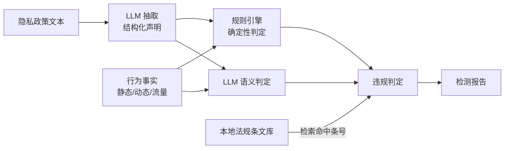
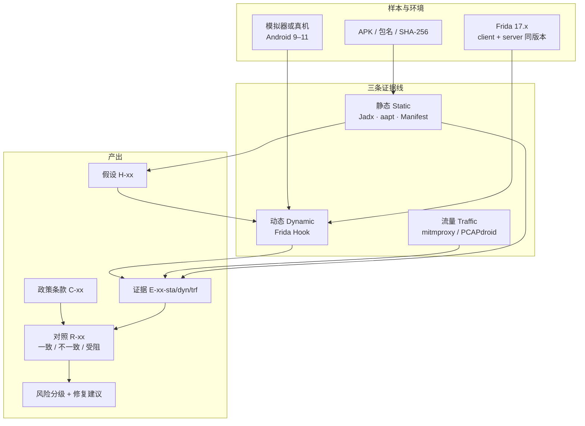
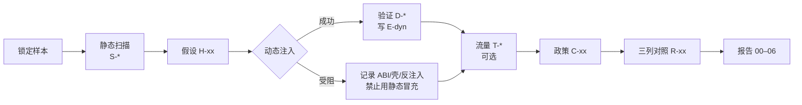
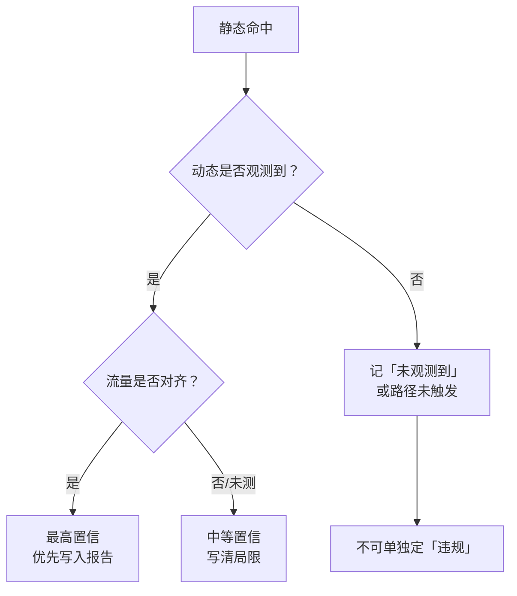
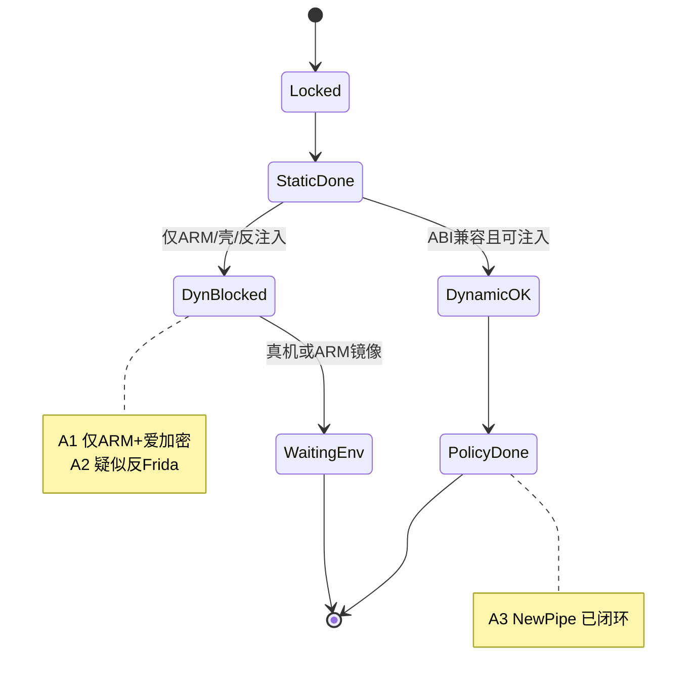

# App Privacy Audit

[English](README.md) | **简体中文**

> 一套 **Android 应用隐私检测** 方法与工具仓库：静态逆向 + 动态 Hook + 流量分析 + **LLM 合规研判引擎**。   
> 三线证据交叉验证，政策与行为自动对齐，结论可复现、法条不编造。

[](https://github.com/ConradLu2740/app-privacy-audit)
[](https://frida.re)
[-3DDC84)](https://developer.android.com)
[](LICENSE)

---

## 写在前面

如果你也做过 App 隐私分析，大概踩过这些坑：

- 静态搜到一堆 `getDeviceId`，**运行时到底调不调用？不知道**
- 商业 App 加了壳，模拟器一启动就崩
- 好不容易 Hook 上，进程立刻自杀（反 Frida）
- 报告写「违规收集」，却拿不出可复现的证据

这个仓库就是围绕这些问题做的：**用三条证据线把「代码里有」和「运行时真发生」分开写**，并且**把失败也当成结果记下来**。

选题背景来自第九届浙江省大学生网络与信息安全竞赛作品挑战赛企业命题（命题方：浙江省质量科学研究院）。本仓库**不参加正式竞赛**，按个人作品集 / 学习复现标准维护。

**适合谁看**

| 你是 | 能从这里拿到什么 |
|------|------------------|
| 安全 / 隐私方向学生 | 一套可抄的检测流程 + 证据编号规范 |
| 想做作品集的开发者 | 真实样本、真实受阻、可讲的故事 |
| 想复现分析的同行 | 环境步骤、脚本、清单、报告骨架 |

---

## 它在解决什么问题

移动 App 常见的隐私风险大致三类：

1. **权限过度索取** — 和功能无关的位置 / 通讯录 / 电话状态  
2. **政策说一套、做一套** — 文案写了「不收集」，代码和 SDK 却在采  
3. **传输与存储不安全** — 明文 HTTP、敏感字段裸奔  

只靠反编译会误报，只靠抓包会漏报，只靠政策会空谈。  
所以本项目固定用 **静态 → 动态 → 政策** 三条线交叉，能对齐的才写「一致 / 不一致」，对不齐的写「受阻 / 待核」。

---

## 方法（三线证据模型 + LLM 合规研判）

### 合规研判引擎

`audit/` 是一套可运行的检测流水线，把「隐私政策 ↔ 实际行为 ↔ 法规条文」三列对照
从人工填写变成自动化环节：



**三条防幻觉闸门**——LLM 只做语义理解，不允许它生成事实与法条：

1. **原文引证校验**：LLM 抽取的每条政策声明必须附原文片段，代码做子串匹配，
   不通过即丢弃并计入丢弃率。编造政策内容在架构上不可能通过。
2. **条文核对状态**：法规条文库中 `status=unverified` 的条目默认不参与判定，
   除非显式开启。工具自身强制执行「引用前核对原文」的纪律。
3. **证据非空约束**：违规判定的构造强制校验证据编号非空，无证据的判定无法产生。

条号全部由本地条文库检索得出，LLM 不参与条号生成；违规类型取自闭集，
模型无法编造新类型。

**离线验证**（无需网络与 API key）：

```bash
pip install -r requirements.txt
python -m audit smoke      # 端到端冒烟，产物写入 out/
python -m pytest tests/ -v # 21 项测试，覆盖三条闸门与规则引擎
```

详细用法见 [audit/README.md](audit/README.md)，设计文档见
[docs/design/llm-compliance-engine.md](docs/design/llm-compliance-engine.md)。

### 三线证据模型

### 架构总览



### 标准分析流程



### 证据交叉验证



**关键约定**

- 静态命中只产生**假设**，不直接下「违规」结论  
- 动态「未观测到」≠「不存在」，必须写清操作窗口  
- 注入失败、壳崩溃、反调试，一律记 **受阻**，禁止用静态顶替动态  
- 证据统一编号：`E-<样本>-sta/dyn/trf/pol-nn`

详细流程见 [docs/methodology.md](docs/methodology.md)，勾选清单见 [checklists/privacy-checklist.md](checklists/privacy-checklist.md)。

---

## 样本一览（2026-09-14 锁定）

| ID | 应用 | 包名 | 版本 | 为什么选它 | 动态 |
|----|------|------|------|------------|------|
| **A1** | 墨迹天气 | `com.moji.mjweather` | 9.0942.02 | 天气类，定位与产品强相关，商业 SDK 面大 | 受阻 |
| **A2** | 豆瓣 | `com.douban.frodo` | 7.133.0 | 内容社区，政策可读，与 A1 可横向比 | 受阻 |
| **A3** | [NewPipe](https://github.com/TeamNewPipe/NewPipe) | `org.schabi.newpipe` | 0.29.1 | 开源、无壳、含 x86_64，**动态方法对照** | 成功 |

角色分工：

- **A1 / A2** = 真实商业样本的静态深挖 + 工程受阻记录  
- **A3** = 证明整条动态/合规链路在本环境可复现，并作为低采集基线  

完整哈希、渠道、Jadx 文件数见 [docs/report/01-samples.md](docs/report/01-samples.md)。  
APK **不会**进仓库，请自行从官方渠道下载。

---

## 结果摘要（诚实版）

| 样本 | 静态 | 动态 | 政策对照 | 结论一句话 |
|------|------|------|----------|------------|
| A1 墨迹 | 完成 | **受阻**（仅 ARM + 爱加密壳在 x86_64 AVD 崩溃） | 未做 | 权限/SDK 面很大，运行时无法在本环境证实 |
| A2 豆瓣 | 完成 | **受阻**（疑似反 Frida，attach 后进程死） | 未做 | 有自研 deviceId 与较多剪贴板代码，需更弱对抗环境 |
| A3 NewPipe | 完成 | **完成** | **完成** | 权限极少；30s 剧本内未观测到标识符/定位；与政策一致 |

样本推进状态：



**A3 动态剧本（可复现）**

1. `pm clear` → 冷启动 `MainActivity`  
2. 约 1s 后 `frida -U -p <pid> -l scripts/frida/all_hooks.js`  
3. 点按底部 Tab、滚动列表、进入条目，约 30 秒  
4. 进程全程存活；Hook 日志中无 IMEI / ANDROID_ID / 定位等业务命中  

证据文件在 `evidence/org.schabi.newpipe/`（`E-A3-sta-01` / `E-A3-dyn-01` / `E-A3-dyn-02` / `E-A3-pol-01`）。

完整报告目录：

| 章节 | 文件 |
|------|------|
| 样本 | [docs/report/01-samples.md](docs/report/01-samples.md) |
| 静态 | [docs/report/02-static-analysis.md](docs/report/02-static-analysis.md) |
| 动态 | [docs/report/03-dynamic-analysis.md](docs/report/03-dynamic-analysis.md) |
| 流量 | [docs/report/04-traffic-analysis.md](docs/report/04-traffic-analysis.md)（骨架） |
| 合规 | [docs/report/05-compliance-review.md](docs/report/05-compliance-review.md) |
| 结论 | [docs/report/06-findings-and-fixes.md](docs/report/06-findings-and-fixes.md)（骨架） |

---

## 5 分钟上手（复现 A3 动态）

### 你至少需要

- Windows / macOS / Linux  
- Android SDK（`adb` + Emulator）或已 root 的模拟器/真机  
- Python 3.10+  
- 能下载 APK 的网络  

### 步骤

**1. 装 Frida**

```bash
pip install frida-tools
frida --version   # 记下版本号，例如 17.18.0
```

**2. 准备模拟器**

用 Android Studio 建一台 **API 30 / x86_64** 的 AVD（本仓库验证用的镜像是 `google_apis;x86_64`）。

```bash
adb devices          # 应看到 emulator-xxxx
adb root             # 模拟器一般需要 root 才能跑 frida-server
```

**3. 推送并启动 frida-server**

到 [Frida Releases](https://github.com/frida/frida/releases) 下载与客户端**同版本**的  
`frida-server-<ver>-android-x86_64.xz`，解压后：

```bash
adb push frida-server /data/local/tmp/
adb shell chmod 755 /data/local/tmp/frida-server
adb shell "/data/local/tmp/frida-server -D &"
frida-ps -U | head
```

**4. 安装 NewPipe（对照样本）**

从 [F-Droid](https://f-droid.org/packages/org.schabi.newpipe/) 或 GitHub Release 自行下载 APK：

```bash
adb install -r NewPipe.apk
```

**5. 跑 Hook**

```bash
adb shell am start -n org.schabi.newpipe/.MainActivity
adb shell pidof org.schabi.newpipe

# 注意：商业 App 常见 -f spawn；Frida 17 不要再加 --no-pause
frida -U -p <上面的pid> -l scripts/frida/all_hooks.js
```

正常应看到一串：

```text
[HOOK][all] installing combined hooks...
[HOOK][device] hooked android.telephony.TelephonyManager.getDeviceId
...
[HOOK][all] combined hooks ready
```

然后在模拟器里随便点点；若出现 `[HOOK][...] xxx() -> ...`，那就是运行时命中。

**6. 归档证据（可选）**

按 [evidence/README.md](evidence/README.md) 写一页脱敏说明，编号 `E-...-dyn-nn`，日志去掉 token / 手机号。

更细的环境记录（含本仓库验证时的路径示例）见 [docs/environment.md](docs/environment.md)。

---

## 本机验证环境（参考）

| 项 | 值 |
|----|----|
| OS | Windows 11 |
| 模拟器 | Android SDK Emulator，AVD `privacy-api30` |
| 系统 | Android 11（API 30），x86_64 |
| Frida | client + server 17.18.0 |
| Jadx | 1.5.1 |
| 验证日期 | 2026-09-14 |

你的路径可以完全不同；**只要 Frida 能列出进程、A3 能 attach 且不自杀**，方法就算复现成功。

---

## 仓库结构

```text
app-privacy-audit/
├── README.md                 ← 英文（GitHub 默认）
├── README.zh-CN.md           ← 中文
├── HANDOFF.md                ← 项目现状与续作说明
├── LICENSE
├── audit/                    ← LLM 合规研判引擎（可运行流水线）
│   ├── llm/                  #   Provider 抽象层
│   ├── policy/               #   政策 → 结构化声明
│   ├── regulation/           #   本地法规条文库
│   ├── align/                #   声明-行为对齐引擎
│   └── report/               #   报告生成
├── fixtures/                 # 冒烟与测试用固定数据
├── tests/                    # 21 项测试
├── config.example.yaml       # 引擎配置样例
├── docs/
│   ├── design/               # 引擎设计文档
│   ├── methodology.md        # 三线方法与假设驱动
│   ├── compliance.md         # 政策↔行为↔法规怎么对齐
│   ├── environment.md        # 环境记录与冒烟
│   ├── sample-candidates.md  # 选样过程
│   └── report/               # 00–06 完整报告章节
├── checklists/
│   └── privacy-checklist.md  # 统一 S/D/T/C 检查清单
├── scripts/frida/            # device_id / location / all_hooks 等
├── evidence/                 # 脱敏证据（按包名分目录）
└── assets/
```

---

## 常见问题

**Q: 为什么 A1/A2 动态没数据？是脚本坏了吗？**  
A: 不是。同环境 NewPipe 与计算器都能注入成功。A1 是 ABI/加固问题，A2 疑似反注入。详见动态报告里的「受阻」小节。

**Q: 静态搜到 `getDeviceId` 能不能直接写违规？**  
A: 不能。静态只说明「代码路径存在」。要结合动态时序、政策声明和法规要件。

**Q: 可以拿去扫别的 App 吗？**  
A: 方法和脚本可以；请只在**自有设备**上对**公开分发**应用做研究，遵守当地法律与目标 App 条款。不要把 APK、原始 PCAP、他人隐私提交到公开仓库。

**Q: 合规研判引擎会把数据发给第三方吗？**  
A: 只有**隐私政策文本**会发送至配置的 LLM 服务用于结构化抽取。政策文本本身是公开的合规文档。
不发送抓包载荷、不发送个人信息、不发送 APK。凭据只从环境变量或本地 `config.yaml` 读取，
两者都在 `.gitignore` 中。若需完全离线，可把 provider 换成本地部署的 OpenAI 兼容推理服务。

**Q: 想继续做流量线？**  
A: 从 [docs/report/04-traffic-analysis.md](docs/report/04-traffic-analysis.md) 和 [scripts/traffic/README.md](scripts/traffic/README.md) 开始；注意 Android 7+ 用户证书限制与 SSL pinning。

---

## 声明与边界

- 仅用于安全研究、合规学习与教学演示。  
- 不传播完整 APK，不提交原始含隐私流量。  
- 观测窗口与版本有限；「未观测到」不是法律意义上的「不存在」。  
- 法规条文引用前请自行核对现行有效文本。

---

## License

[MIT](LICENSE) — 欢迎提 Issue / PR 改进清单与脚本；请勿提交样本二进制。

如果这个仓库对你有帮助，给个 Star 会让作者更有动力补流量线和更多样本。
