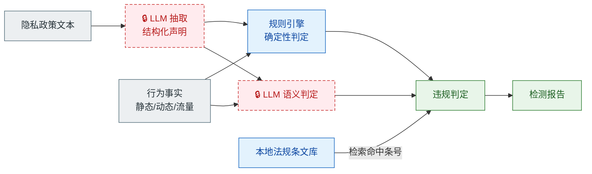

# LLM 合规研判引擎 · 使用说明

> 对应赛题一「移动应用 APP 隐私数据泄露的智能化检测与合规评估」答题要求第三条：
> **基于大语言模型，结合隐私政策文本与实际行为进行合规综合研判。**

设计文档见 [docs/design/llm-compliance-engine.md](docs/design/llm-compliance-engine.md)。

---

## 这个引擎做什么

把「隐私政策 ↔ 实际行为 ↔ 法规条文」三列对照从人工填写，变成可执行、可评测、可复现的流水线环节。



---

## 三条防幻觉闸门

这是本引擎的核心设计。LLM 用于语义理解，但**不允许它生成事实与法条**。

| 闸门 | 机制 | 代码位置 |
|------|------|----------|
| **原文引证校验** | LLM 抽取的每条声明必须附政策原文片段，代码做子串匹配，不通过即丢弃并计数 | `audit/policy/extractor.py` |
| **条文核对状态** | 法规条文库中标为 `unverified` 的条目默认不参与判定，除非显式传入 `--allow-unverified` | `audit/align/engine.py` |
| **证据非空约束** | `Finding` 构造时校验 `evidence_refs` 与 `behavior_facts` 非空，无证据的判定在架构上无法产生 | `audit/schema.py` |

另外，**所有条号都由本地条文库检索得出，LLM 不参与条号生成**；所有违规类型取自 `ViolationType` 闭集，模型无法编造新的类型。

---

## 安装

```bash
pip install -r requirements.txt
```

## 快速验证（无需网络与 API key）

```bash
python -m audit smoke
```

用仓库自带的固定数据跑通「政策抽取 → 对齐研判 → 报告生成」全链路，产物写入 `out/`。
这是给评审核查源码用的离线复现路径。

```bash
python -m pytest tests/ -v     # 21 项测试，覆盖三条闸门与规则引擎
python evals/run_eval.py       # 6 个评测用例：判定 P/R/F1 + 防幻觉闸门断言（离线可复现）
```

评测集详见 [evals/README.md](../evals/README.md)：覆盖事前收集、超范围、未声明共享、明文传输、
**幻觉引证闸门**与干净对照六类场景，`--live` 可切换真实 LLM 实测。

---

## 配置

复制 `config.example.yaml` 为 `config.yaml`，填写 LLM 凭据：

```yaml
llm:
  provider: proma-cloud
  api_key: "你的 key"
  base_url: "https://api.proma.cool"
  model: ""
```

也可以全部走环境变量，避免把密钥写进文件：

```bash
export AUDIT_LLM_API_KEY=...
export AUDIT_LLM_BASE_URL=...
export AUDIT_LLM_MODEL=...
```

`config.yaml` 与 `.env` 已在 `.gitignore` 中，不会被提交。

### 更换 LLM 服务

业务代码只依赖 `LLMProvider` 接口，不依赖任何具体厂商。更换服务只改配置：

| provider | 用途 |
|----------|------|
| `proma-cloud` | 默认。走 Proma Cloud 的 OpenAI 兼容端点 |
| `openai-compatible` | 任意 OpenAI 兼容服务。把 `base_url` 指向本地部署的推理服务（如 Ollama 的 `http://localhost:11434/v1`）即可，无需改代码 |
| `fake` | 不触网，按 `fixtures/fake_responses.json` 返回固定结果，用于测试与离线复现 |

### 数据流向披露

引擎会把**被测应用的隐私政策文本**发送至配置的 LLM 服务用于结构化抽取。
不发送抓包载荷、不发送个人信息、不发送 APK。政策文本本身是公开的合规文档。

---

## 三个子命令

### 1. 抽取政策声明

```bash
python -m audit policy-extract \
  --sample A3 \
  --policy fixtures/policy_a3.txt \
  --source-url "https://newpipe.net/legal/privacy/" \
  --out out/D-A3.json
```

输出结构化声明与抽取质量统计（丢弃率、条款数、未声明类别占位）。

### 2. 对齐研判

```bash
python -m audit align \
  --facts fixtures/facts_a3.json \
  --declarations out/D-A3.json \
  --policy fixtures/policy_a3.txt \
  --app-category 在线影音类 \
  --out out/F-A3.json
```

加 `--allow-unverified` 可查看条文检索效果（默认关闭，未核对条文会被剔除）。

### 3. 生成报告章节

```bash
python -m audit report \
  --findings out/F-A3.json \
  --facts fixtures/facts_a3.json \
  --declarations out/D-A3.json \
  --stats out/D-A3.json \
  --out out/05-compliance-review.md
```

---

## 输入数据格式

### 行为事实（三线分析的产出）

三线分析（静态 / 动态 / 流量）的结果归一化为 `BehaviorFact`，这是引擎的输入。

```json
{
  "facts": [
    {
      "fact_id": "BF-A3-dyn-001",
      "sample": "A3",
      "source": "dynamic",
      "evidence_ref": "E-A3-dyn-01",
      "data_type": "device_id",
      "raw_observation": "TelephonyManager.getDeviceId() 在隐私弹窗出现前被调用",
      "actor": "app",
      "phase": "before_consent",
      "confidence": "observed",
      "observed_at": "2026-09-17T10:00:01+08:00"
    }
  ]
}
```

关键字段：

| 字段 | 说明 |
|------|------|
| `source` | `static` / `dynamic` / `traffic`，对应三线 |
| `data_type` | 归一化数据类别，取自 `DataType` 闭集。三线与政策共用同一套取值，才能做集合差集 |
| `phase` | `before_consent` / `after_consent`。这是「同意前收集」判定的唯一依据 |
| `confidence` | `observed`（运行时真发生）/ `code_path_only`（仅代码路径存在）。后者只能产出降级的待核项 |
| `actor` | `app` 或 `sdk:<包名>`，用于第三方 SDK 归因 |
| `evidence_ref` | 指向仓库既有证据编号 `E-<样本>-sta/dyn/trf-nn`，沿用原有体系 |

### 政策声明

由 `policy-extract` 子命令产出，一般不需要手工编写。

---

## 判定分工

| 违规类型 | 判定方式 | 理由 |
|----------|----------|------|
| 同意前收集 | 规则引擎 | 本质是时序比较，无需语义理解 |
| 明文传输 | 规则引擎 | 传输协议字段比较，确定性判定 |
| 未提供删除渠道 | 规则引擎 | 政策文本关键词检查 |
| 超范围收集 | 规则 + LLM | 差集是集合运算；「是否属必要」需语义判断 |
| 未声明共享 | 规则 + LLM | 差集确定候选；「是否已声明」需语义匹配 |
| 政策与行为矛盾 | LLM 语义判定 | 需理解声明文本的真实含义 |

这个分流的收益：占多数的时序类、传输类判定 100% 确定性可复现，不引入幻觉；LLM 只在语义模糊处介入，调用成本与出错面都可控。

---

## 法规条文库

`audit/regulation/data/` 下按法律分文件：

| 文件 | 覆盖 |
|------|------|
| `pipl.json` | 《个人信息保护法》与赛题相关的 13 条 |
| `cac_2019_1.json` | 《App 违法违规收集使用个人信息行为认定方法》六大类 |
| `necessary_scope.json` | 《常见类型移动互联网应用程序必要个人信息范围规定》 |

**所有条目的 `status` 初始为 `unverified`，这是刻意的默认值。**
核对官方原文后，把对应条目的 `status` 改为 `verified` 并填写 `verified_on`，判定中才会引用它。
这样工具自身就在强制执行「引用前核对原文」的纪律，而不是靠人记着。

违规类型到条文的映射写在 `audit/regulation/mapping.py`，是确定性代码，不经过 LLM。

---

## 目录结构

```text
audit/
├── cli.py                  命令行入口
├── schema.py               数据模型与枚举
├── llm/                    Provider 抽象层
│   ├── base.py             接口 + JSON 容错解析
│   ├── openai_compat.py    通用 OpenAI 兼容实现
│   ├── proma_cloud.py      Proma Cloud 实现
│   ├── fake.py             测试与离线复现
│   └── factory.py          按配置构建
├── policy/                 政策 → 结构化声明
├── regulation/             法规条文库与检索
├── align/                  规则引擎 + 语义判定 + 编排
└── report/                 报告生成
fixtures/                   冒烟与测试用固定数据
tests/                      21 项测试
```

---

## 局限

- 判定依赖输入的行为事实完整性。缺少动态或流量证据时，相关判定会被降级并标记待核。
- LLM 语义判定存在波动，所有 `decided_by=semantic` 的条目都需人工复核。
- 条文库覆盖范围限于本赛题相关的条款子集，不是法规全文检索。
- 「未观测到」不等于「不存在」。观测窗口、样本版本与设备环境都会影响结果。
