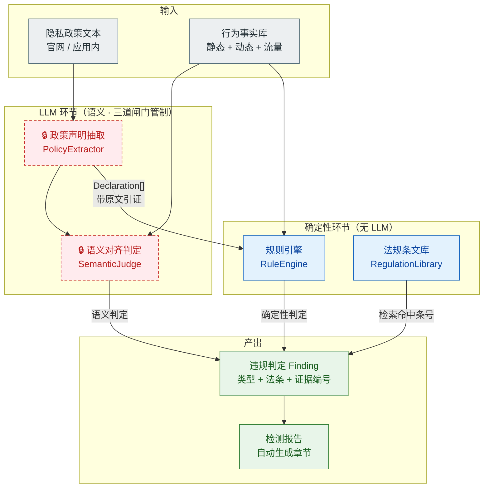

# LLM 合规研判引擎 · 设计文档

> 版本 v0.1｜日期 2026-09-17｜状态：待实现
> 对应赛题：赛题一「移动应用 APP 隐私数据泄露的智能化检测与合规评估」答题要求第三条
> 对应评分：合规判断准确性 30%、创新性与深度 20%、技术分析完整度 30%

---

## 1. 设计目标与约束

### 1.1 要解决的问题

赛题原文要求「**基于大语言模型**，结合隐私政策文本与实际行为进行合规综合研判」。现有仓库完全没有实现这部分——`docs/compliance.md` 只写了 LLM 使用边界，`docs/methodology.md` 限定 LLM 仅可用于政策摘要草稿。

本模块要把「隐私政策 ↔ 实际行为 ↔ 法规条文」三列对照从人工填写，变成可自动执行、可评测、可复现的流水线环节。

### 1.2 三条硬约束

| 约束 | 来源 | 设计后果 |
|------|------|----------|
| **法规条文不得由 LLM 生成** | 仓库既有纪律「引用前核对原文，不编条号」；合规准确性 30% 是最高权重项 | 法条改由本地条文库检索命中，LLM 不参与条号生成 |
| **结论必须可追溯到证据** | 赛题「证据充分性 20%」要求可复现的截图、日志、代码片段 | 每条判定强制携带 `behavior_facts` 与 `evidence_refs`，无证据不得出判定 |
| **无 API key 也能复现** | 比赛说明要求源码支持专家功能验证 | Provider 抽象层 + 离线回放模式 |

### 1.3 明确不做

- 不做通用合规问答机器人
- 不让 LLM 输出「违法 / 违规」的最终法律结论，只输出**结构化事实归类 + 推理说明**，判定由规则引擎落定
- 不做法规全文检索（只覆盖与本赛题相关的条款子集，约 40 条）

---

## 2. 总体架构



### 2.1 核心设计决策：规则优先 + LLM 兜底

**不让 LLM 负责全部判定。** 按违规类型的性质分流：

| 违规类型 | 判定方式 | 理由 |
|----------|----------|------|
| 同意前收集 | **纯规则** | 本质是时序比较，`phase == before_consent` 即可判定，不需要语义理解 |
| 明文传输 | **纯规则** | `transport == http` 且数据类型敏感，确定性判定 |
| 超范围收集 | **规则做差集 + LLM 判必要性** | 差集是集合运算；「是否属于必要个人信息」需要语义判断 |
| 未声明第三方共享 | **规则做差集 + LLM 语义匹配** | 政策常写「某公司及其关联方」，需语义对齐到具体 SDK/域名 |
| 政策与行为矛盾 | **LLM 语义推理** | 「声明不收集却收集」需要理解声明文本的真实含义 |
| 未提供删除渠道 | **规则** | 检查政策中是否存在删除/注销条款 |

这个分流带来三个收益，都是评分点：

1. **准确率可控**：占多数的时序类、传输类判定是 100% 确定性的，不引入 LLM 幻觉
2. **成本可控**：LLM 调用只发生在语义模糊处
3. **可评测**：确定性部分可写单元测试；语义部分用人工标注集测一致率

---

## 3. 数据模型

四个核心实体，全部为可序列化的 dataclass。完整定义见 `audit/schema.py`。

### 3.1 BehaviorFact — 统一行为事实

三线分析的原始产出归一化成原子事实。这是整个模块的地基。

```python
@dataclass
class BehaviorFact:
    fact_id: str              # BF-<sample>-<source>-<nnn>
    sample: str               # A1 / A2 / A3 / B1 ...
    source: FactSource        # static | dynamic | traffic
    evidence_ref: str         # 指向既有证据编号 E-A1-dyn-02
    data_type: DataType       # 归一化数据类别（见 3.5）
    raw_observation: str      # 原始观测点，如 TelephonyManager.getDeviceId
    actor: str                # app | sdk:<pkg> | unknown
    phase: ConsentPhase       # before_consent | after_consent | unknown
    destination: str | None   # 流量线才有：目标域名
    transport: Transport | None  # https | http | null
    confidence: Confidence    # observed | code_path_only
    observed_at: str | None   # ISO8601
    note: str = ""
```

**关键字段说明**

- `confidence`：区分「运行时真发生」与「代码里有」。这一字段继承仓库既有认知纪律——静态命中只产生假设，不得单独定为违规。**规则引擎强制要求 `confidence == observed` 才能产出高风险判定**，`code_path_only` 只能产出待核项。
- `phase`：同意前 / 同意后。这是「同意前收集」违规判定的唯一依据，也是本模块最具监管价值的检测能力。
- `actor`：采集行为归因到 App 自身还是第三方 SDK。用于「发现额外安全风险」这一创新分项。

### 3.2 Declaration — 政策声明

LLM 从隐私政策文本抽出的结构化声明。

```python
@dataclass
class Declaration:
    decl_id: str              # D-<sample>-<nnn>
    sample: str
    clause_id: str            # 沿用仓库既有 C-xx 编号
    data_type: DataType
    purpose: str
    collect_phase: ConsentPhase
    shared_with: list[str]
    transport_protected: bool | None
    quote: str                # 原文引证，强制字段
    confidence: DeclConfidence  # explicit | inferred | absent
```

**防幻觉第一道闸：`quote` 子串校验。**
LLM 抽取的每条声明必须附原文片段。抽取器随后在政策原文中做子串匹配，匹配失败的声明**直接丢弃**，并计入丢弃率统计。这使「LLM 编造政策内容」在架构上不可能通过。

### 3.3 RegulationArticle — 法规条文

```python
@dataclass
class RegulationArticle:
    article_id: str           # PIPL-6
    law: str                  # 中华人民共和国个人信息保护法
    article: str              # 第六条
    title: str
    text: str
    tags: list[str]           # minimal_necessity / purpose_limitation ...
    verified_on: str | None   # 核对原文日期
    status: str               # verified | unverified
```

**防幻觉第二道闸：未核对条文不得引用。**
条文库中 `status == "unverified"` 的条目，默认**不允许出现在最终判定中**，除非显式传入 `--allow-unverified`。这使工具自身强制执行「引用前核对原文」的纪律，而不是靠人记着。

### 3.4 Finding — 违规判定

```python
@dataclass
class Finding:
    finding_id: str           # F-<sample>-<nnn>
    sample: str
    violation_type: ViolationType
    severity: Severity        # high | medium | low | info
    behavior_facts: list[str]
    declarations: list[str]
    regulation_refs: list[str]  # 检索命中的条号
    evidence_refs: list[str]
    rationale: str              # LLM 或规则的推理说明
    needs_review: bool          # 低置信度标记人工复核
```

**防幻觉第三道闸：`evidence_refs` 非空。**
`Finding` 构造时校验 `evidence_refs` 与 `behavior_facts` 均非空，否则抛异常。无证据的判定在架构上无法产生。

### 3.5 归一化枚举

**DataType**（数据类别，静态与政策两侧共用同一套值，才能做差集）

```text
device_id       设备标识（IMEI / ANDROID_ID / OAID / MAC / 序列号）
location        位置（精确 / 粗略）
contacts        通讯录
sms             短信
call_log        通话记录
phone_state     电话状态
installed_apps  已安装应用列表
clipboard       剪贴板
photo_media     相册 / 媒体文件
audio_record    录音
camera          相机
sensor          传感器 / 活动识别
account         账号 / 手机号
storage_files   外部存储文件
```

**ViolationType**（闭集，LLM 只能在此集合内选择）

```text
no_public_rules          未公开收集使用规则
no_explicit_consent      未经同意收集
collect_before_consent   同意前收集
beyond_scope             超范围 / 超必要收集
undeclared_sharing       未声明第三方共享
insecure_transport       明文传输
deceptive_policy         政策与实际行为矛盾
no_deletion_channel      未提供删除 / 注销渠道
```

这八个类型直接对应《App 违法违规收集使用个人信息行为认定方法》的六大类加两个传输/渠道类。**把开放生成问题变成闭集分类问题，是准确率的主要保障。**

---

## 4. LLM Provider 抽象层

### 4.1 接口

```python
class LLMProvider(ABC):
    @property
    @abstractmethod
    def name(self) -> str: ...

    @abstractmethod
    def chat(
        self,
        messages: list[ChatMessage],
        *,
        system: str | None = None,
        temperature: float = 0.0,
        json_mode: bool = False,
    ) -> str: ...
```

### 4.2 实现清单

| 实现 | 用途 | 说明 |
|------|------|------|
| `PromaCloudProvider` | **开发与演示默认** | 继承 OpenAI 兼容实现，走 Proma Cloud 端点，模型可选 |
| `OpenAICompatibleProvider` | 通用底座 | 任意 OpenAI 兼容端点，通过 `base_url` 切换 |
| `FakeProvider` | **测试与离线回放** | 按任务标记返回固定响应，用于冒烟测试与无网络复现 |

### 4.3 关于本地模型的诚实说明

当前不实现 Ollama 专用 provider，因为本项目不引入本地模型依赖。但 `OpenAICompatibleProvider` 已支持任意兼容端点——Ollama 的 `/v1` 接口即属此类，配置 `base_url` 即可接入，无需改代码。

因此在作品材料中的表述应当是：

> 本作品默认使用云端 LLM 服务；架构上通过 Provider 抽象层解耦，更换为本地部署的 OpenAI 兼容推理服务（如 Ollama）只需修改配置文件的 `base_url`，无需改动业务代码。

这是可验证的陈述，不是空头承诺——`OpenAICompatibleProvider` 的存在本身就是证据。

### 4.4 数据流向披露

作品材料中必须如实说明：被测应用的隐私政策文本会发送至第三方 LLM 服务用于结构化抽取。这是附件3 第五条第三款「涉及第三方数据、模型应说明来源与许可」的要求，也是决赛「安全性与合规性」可能被质询的点。

缓解措施：只发送政策文本（本身是公开的合规文档），**不发送**抓包载荷、不发送任何个人信息、不发送 APK。这一边界要在代码中以注释和文档形式固化。

---

## 5. 各模块设计

### 5.1 政策声明抽取（`audit/policy/extractor.py`）

**输入**：政策全文
**输出**：`list[Declaration]`

流程：

1. 按条款切分（正则识别「一、」「1.」「第 X 条」等编号形式，或按段落长度切分）
2. 逐段调用 LLM，要求返回 JSON 数组，每条含 `data_type` / `purpose` / `collect_phase` / `shared_with` / `transport_protected` / `quote`
3. **子串校验**：`quote` 必须在原文中出现，否则丢弃该条
4. 枚举校验：`data_type` 必须在 `DataType` 闭集内，否则丢弃
5. 汇总去重，统计丢弃率（丢弃率进评测报告）

**关键设计**：`data_type` 为 `absent` 的处理。政策未提及某类数据，不等于不收集。抽取器对政策中**完全未出现**的数据类别，生成 `confidence=absent` 的占位声明，用于「超范围收集」的差集计算。

### 5.2 法规条文库（`audit/regulation/`）

**数据**：JSON 文件，按法律分文件。覆盖范围：

| 文件 | 覆盖 | 条数（约） |
|------|------|-----------|
| `pipl.json` | 《个人信息保护法》与赛题相关的条款 | 20 |
| `cac_2019_1.json` | 《App 违法违规收集使用个人信息行为认定方法》六大类 | 8 |
| `necessary_scope.json` | 《常见类型移动互联网应用程序必要个人信息范围规定》 | 10 |

**检索接口**：

```python
class RegulationLibrary:
    def search(self, *, tags: list[str] | None = None,
               violation_type: str | None = None,
               text_query: str | None = None) -> list[RegulationArticle]: ...
    def get(self, article_id: str) -> RegulationArticle: ...
    def verified_only(self) -> "RegulationLibrary": ...
```

**映射规则**：`ViolationType` → 条文 `tags` 的映射表写在 `regulation/mapping.py`，是确定性代码，不经过 LLM。例如 `collect_before_consent` → `[consent_required, notification]` → 命中 PIPL 第 13、14、17 条与 CAC 认定方法第三类。

### 5.3 对齐引擎（`audit/align/engine.py`）

编排流程：

```text
1. 载入 BehaviorFact[] 与 Declaration[]
2. 规则引擎跑确定性判定（rules.py）
     - 同意前收集
     - 明文传输
     - 未提供删除渠道
3. 集合差集计算
     - 行为数据类型集合 − 声明覆盖集合 → 候选「超范围」
     - 观测到的域名/SDK 集合 − 声明共享对象集合 → 候选「未声明共享」
4. 对差集结果与矛盾候选调用 LLM 语义判定（semantic.py）
5. 汇总为 Finding[]，逐条附加法规检索结果
6. 过滤未核对条文，标记低置信度项
```

### 5.4 语义判定（`audit/align/semantic.py`）

三处使用 LLM，全部限定输出为结构化 JSON：

| 场景 | 输入 | 输出 |
|------|------|------|
| 必要性判断 | 差集候选 + 应用类型 + 政策声明的收集目的 | `{is_necessary: bool, reason: str}` |
| 共享对象语义匹配 | 观测到的 SDK/域名 + 政策共享对象列表 | `{matched: str, confidence: float}` |
| 政策矛盾判定 | 声明文本 + 行为事实 | `{contradicts: bool, violation_type: str, reason: str}` |

每处都要求返回 `reason`，并写入 `Finding.rationale`，便于人工复核。

### 5.5 报告生成（`audit/report/generator.py`）

从 `Finding[]` 生成 Markdown 章节，替代手工填写的 `docs/report/05-compliance-review.md`。输出结构：

- 违规总表（类型 / 严重级别 / 法条 / 证据编号）
- 按样本分节，每节含：三列对照表、逐条推理说明、证据引用
- 评测指标（LLM 抽取丢弃率、语义判定与人工标注一致率）
- 法规核对记录表（自动带出 `verified_on`）

---

## 6. 评测方法

合规准确性 30% 不能只靠自述，必须有数字。设计两套评测：

### 6.1 抽取准确率

对 3 个样本的政策文本逐条人工标注 `Declaration`，作为金标准。度量：

- 声明召回率 = 正确抽出的声明数 / 人工标注总数
- 声明准确率 = 正确抽出的声明数 / LLM 抽出总数
- 丢弃率 = 未通过 `quote` 校验的条数 / LLM 返回总条数

### 6.2 研判一致率

对每个 `Finding`，人工独立判定「是否成立」与「类型是否正确」，计算：

- 一致率 = 人工与流水线判定相同的条数 / 总条数
- 分歧类型分布（类型选错 / 严重级别偏差 / 漏报）

**这套数字本身就是作品材料中的证据**——它把「用了 LLM」从口号变成可量化的技术指标，直接支撑技术性 25%。

---

## 7. 目录结构与接口约定

```text
app-privacy-audit/
├── audit/
│   ├── cli.py                    # 命令行入口
│   ├── schema.py                 # 数据模型与枚举
│   ├── llm/
│   │   ├── base.py               # LLMProvider 抽象 + ChatMessage
│   │   ├── openai_compat.py      # 通用 OpenAI 兼容实现
│   │   ├── proma_cloud.py        # Proma Cloud 实现
│   │   ├── fake.py               # 测试用固定响应 provider
│   │   └── factory.py            # 按配置构建 provider
│   ├── policy/
│   │   ├── extractor.py          # 政策 → Declaration
│   │   └── prompts.py            # 提示词模板
│   ├── regulation/
│   │   ├── loader.py             # RegulationLibrary
│   │   ├── mapping.py            # ViolationType → tags 映射
│   │   └── data/*.json           # 条文种子数据
│   ├── align/
│   │   ├── rules.py              # 确定性规则
│   │   ├── semantic.py           # LLM 语义判定
│   │   └── engine.py             # 编排
│   └── report/
│       └── generator.py
├── fixtures/                     # 冒烟与评测固定数据
│   ├── policy_a3.txt
│   ├── facts_a3.json
│   └── fake_responses.json
├── tests/
│   └── test_smoke.py             # 端到端无网络冒烟
└── config.example.yaml           # provider 与模型配置样例
```

### CLI 约定

```bash
# 抽取政策声明
python -m audit policy-extract --sample A3 --policy fixtures/policy_a3.txt --out out/D-A3.json

# 对齐研判
python -m audit align --facts fixtures/facts_a3.json --declarations out/D-A3.json --out out/F-A3.json

# 生成报告章节
python -m audit report --findings out/F-A3.json --out out/05-compliance-review.md

# 端到端冒烟（使用 FakeProvider，无需网络与 key）
python -m audit smoke
```

---

## 8. 实现顺序

| 阶段 | 内容 | 产出 |
|------|------|------|
| S1 | `schema.py` + `llm/` 全部实现 | 数据模型与 provider 层可用 |
| S2 | `regulation/` 条文库与检索 | 可检索条号，未核对状态生效 |
| S3 | `policy/` 抽取器 + 子串校验 | 政策 → 结构化声明 |
| S4 | `align/` 规则引擎与语义判定 | 行为事实 + 声明 → 违规判定 |
| S5 | `report/` 生成器 + CLI | 端到端可跑 |
| S6 | `fixtures/` + 冒烟测试 | 无网络可复现 |

S1–S6 即本次骨架交付范围。真实样本数据接入与评测标注集属于 W2–W4 工作。

---

## 8.1 实测发现的待调优项

以下问题在 2026-09-17 用真实模型（glm-5.3）跑 `fixtures/policy_a3.txt` 时发现，
尚未修改，需在 W2 接入真实样本时验证后调整：

1. **声明覆盖不完整**。当前提示词只要求抽取「收集」类声明。测试中政策写
   「我们采用加密方式存储您的账号信息」，模型未产出 `account` 声明——因为该句说的是
   存储而非收集。这本身符合提示词要求，但会导致：若运行时观测到 `account` 数据，
   差集计算会把它当成「政策未声明」而产出假阳。

   **候选修正**（二选一，需实测对比后再定）：
   - 提示词改为覆盖收集 / 存储 / 使用 / 共享四类声明，`collect_phase` 仅用于收集类
   - 或把 `account` 这类常见基础数据从差集候选中排除，改由人工确认

   注意：修改提示词后必须用同一份人工标注集重新测丢弃率与一致率，
   不能凭感觉认为「改完更全」。

2. **推理型模型偶尔不输出 JSON**。已实现一次自动重试（回灌上次返回 + 追加修正指令），
   实测可将这类失败从「丢掉整段条款」降为「正常产出」。若某模型持续失败，
   建议在配置里换模型而非无限重试。

---

## 9. 与现有仓库的衔接

| 现有资产 | 衔接方式 |
|----------|----------|
| 证据编号体系 `E-<样本>-sta/dyn/trf/pol-nn` | `BehaviorFact.evidence_ref` 直接引用，不新建编号体系 |
| 政策条款编号 `C-xx` | `Declaration.clause_id` 沿用 |
| `docs/compliance.md` 三列对照方法 | 成为本模块的方法论依据，实现即该方法论的自动化 |
| `checklists/privacy-checklist.md` | `DataType` 枚举与清单 S/D/T 项对齐 |
| `scripts/frida/*.js` | 动态线产出经人工整理后转为 `BehaviorFact` |
| `docs/report/05-compliance-review.md` | 由本模块生成，人工复核后定稿 |
| 既有认知纪律 | 三条防幻觉闸门在架构层强制执行 |

**重要**：本模块不替换任何既有分析工作，只把「政策对照」这一人工环节自动化。A1/A2 的受阻记录、A3 的闭环结论均保留。
