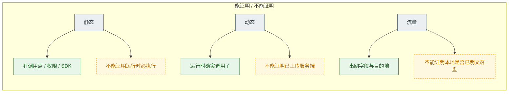
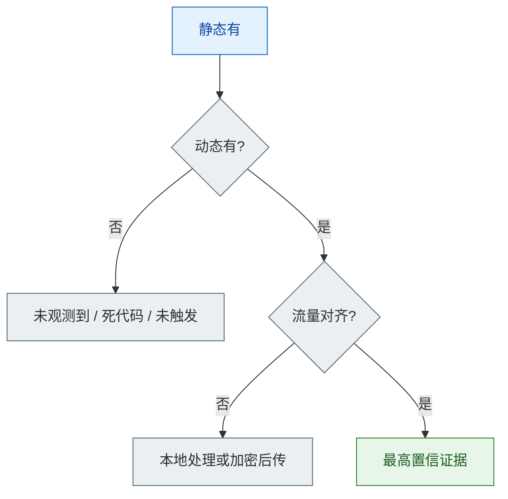
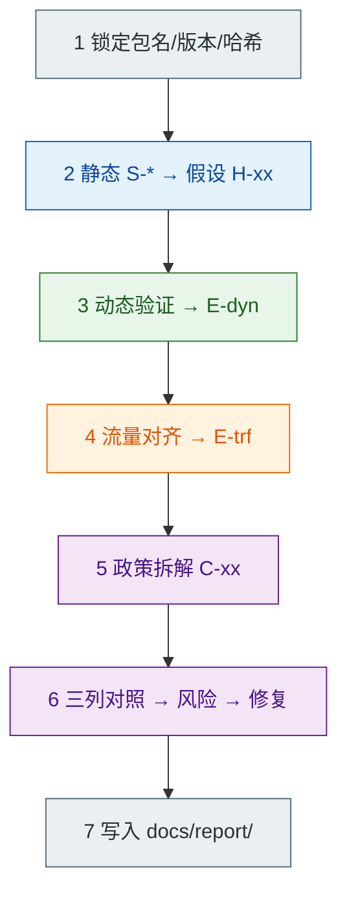

# 分析方法论

本文说明本仓库如何做 Android 隐私泄露检测，保证**可复现、可横向对比**。

## 1. 目标

对 2–3 款真实应用商店 App，回答：

1. 它**声明/代码上可能**收集哪些敏感信息？（静态）
2. 运行时**实际**调用了哪些敏感能力？何时触发？（动态）
3. 这些数据是否**明文或超出声明范围**离开设备？（流量）
4. 与隐私政策、法规要求是否一致？（合规）

## 2. 三线证据模型

| 线 | 工具 | 能证明什么 | 不能单独证明什么 |
|----|------|------------|------------------|
| 静态 | Jadx / Manifest | 存在调用点、权限、SDK | 一定在运行时执行 |
| 动态 | Frida | 运行时确实调用 | 是否成功上传到服务端 |
| 流量 | 代理 / PCAPdroid | 出网内容与目的地 | 本地是否已明文落盘 |

> 同一张图也用于 [README](../README.md) 方法一节——「能证明 / 不能证明」是全仓库的证据纪律。

**交叉验证：**

- 静态有 + 动态无 → 记「未观测到」，可能是路径未触发或死代码  
- 动态有 + 流量无对应 → 可能本地处理/缓存/加密后再发  
- 三线同时命中 → 最高置信，报告中优先展示  

证据编号规则见 [evidence/README.md](../evidence/README.md)。

## 3. 标准流程

（纯文本版：锁定 → 静态 → 假设 → 动态 → 流量 → 政策 → 对照 → 报告）

## 4. 假设驱动（H-xx）

静态发现只产生假设，不直接下「违规」结论。

示例：

| 假设 ID | 来源 | 描述 | 验证方式 | 结果 |
|---------|------|------|----------|------|
| H-01 | S-10 | 启动时读取 IMEI | Frida hook `getDeviceId` 冷启动 | 待测 |
| H-02 | S-12 | 进入首页后请求精确定位 | Hook Location + 操作路径 | 待测 |

## 5. 时序约定

动态与流量记录统一使用：

- 相对时间：`T+0s` 为进程启动  
- 绝对时间：设备本地时区 ISO 字符串  
- 事件标签：`cold_start` / `login` / `open_page_x` / `grant_permission`

便于「敏感 API 调用 → 网络请求」对齐。

## 6. 风险分级（本项目内部标准）

| 级别 | 含义 | 示例 |
|------|------|------|
| 高 | 明文传输设备标识/位置/账号；政策未声明却收集；启动即强索非必要权限 | HTTP 上传 IMEI |
| 中 | 收集范围偏大、政策描述含糊、第三方共享披露不足 | 广告 SDK 读取安装列表且政策一笔带过 |
| 低/观察 | 符合声明但可优化；仅静态线索未动态证实 | 声明收集日志，实际加密上送 |

分级服务报告可读性，**不是**监管行政处罚认定。

## 7. 质量门槛（DoD）

- 每个样本：清单 S/D/T/C 主要项有状态  
- 每个「观测到」≥1 条可复现证据  
- 流量结论必须有过滤条件或脱敏摘录路径  
- 法规条文只引用核对过的版本  
- 局限单独成节（加固、证书、时间窗口、单次安装等）  

## 8. 与工具的关系

- 不自研检测引擎；脚本只做**最小可复现 Hook / 辅助**  
- LLM 仅可用于政策摘要草稿，**结论必须人工改写核对**  
- 优先官方文档与一手观察，不把网传「某 App 有后门」当证据  
