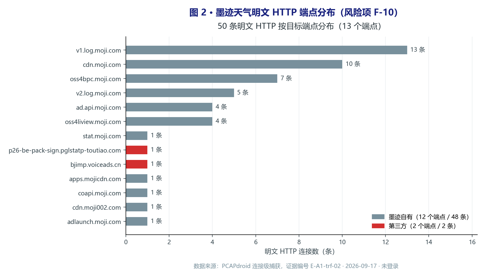
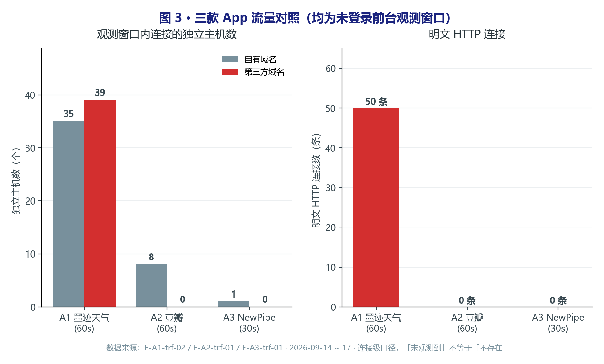

# 04 · 流量分析

> 对应清单 T-*。原始 PCAP 不入库。  
> 分析日期：2026-09-15 · 工具：PCAPdroid 1.8.6（设备侧 VPN，连接级）  
> 设备：小米 14 Ultra（arm64-v8a，无 root）

---

## 0. 解密能力说明

| 项 | A1 | A2 | A3 |
|----|----|----|-----|
| 代理工具 | PCAPdroid | PCAPdroid | PCAPdroid |
| HTTPS 是否解密 | 否 | 否 | 否 |
| 失败原因与替代 | 无 root，用户 CA 不被信任；App 卡 splash 未完成采集 | 无 root，用户 CA 不被信任；连接级元数据可用 | 无 root；连接级元数据可用 |

> **方法说明：** 尝试过 mitmproxy + 用户 CA，Android 7+ 默认不信任用户 CA，商业 App 无法解密。改用 PCAPdroid（Android VPN API）在设备侧捕获**连接级元数据**（目标域名/协议/端口/流量大小），不涉及载荷内容。

## 1. 主机与端点清单

| 样本 | 主机 | 协议 | 是否政策披露 | 备注 |
|------|------|------|--------------|------|
| A1 | — | — | — | **未完成采集**（App 卡 splash） |
| A2 | `frodo.douban.com` | TLS/HTTPS | 归入「安全运行」 | 主 API，61.8 KB+ |
| A2 | `amonsul.douban.com` | HTTPS | 未单独点名 | 自研埋点，8.1 KB |
| A2 | `erebor.douban.com` | TLS | 未单独点名 | 内部服务 |
| A2 | `www.douban.com` | TLS | 是 | Web 内容 |
| A2 | `accounts.douban.com` | DNS | 是 | 账号服务 |
| A2 | `img1/3/9.doubanio.com` | HTTPS | 是（CDN） | 图片 CDN，6.4–79.3 KB |
| A3 | `www.youtube.com` | DNS/TLS/TCP | 是（GDPR） | 唯一目标域名 |

## 2. 关键发现

| 证据 ID | 时间对齐 | 描述 | 敏感字段（脱敏） | 风险 |
|---------|----------|------|------------------|------|
| E-A2-trf-01 | 冷启动+首页 60s | 仅豆瓣自有域名，未见第三方 SDK 域名 | 无 | 低（未触发 ≠ 不存在） |
| E-A3-trf-01 | 冷启动+搜索 30s | 仅 `www.youtube.com`，无第三方追踪 | 无 | 低 |
| E-A1-trf-01 | 冷启动 45s+ | App 卡 splash，未进入主界面 | — | 受阻 |
| E-A1-trf-02 | 首启后主界面 60s | 535 连接 / 74 主机；第三方 SDK（京东/GDT/穿山甲/高德/百度/个推/友盟）全面联网；50 条明文 HTTP 多为自有日志端点 | 无（连接级） | 中（明文日志 + 第三方暴露面大） |

### A1 墨迹（E-A1-trf-02，2026-09-17 首启复测）

- 首启完成协议与定位授权后 60s：535 条连接、74 个独立主机，接收约 19.3 MB
- 静态指纹的第三方 SDK **全部观测到实际网络连接**（京东 69 / GDT 49 / 高德 40 / 穿山甲 27 / 百度 9 / 个推 8 / 友盟 3），静态命中获得流量侧实证
- 50 条明文 HTTP 连接集中于自有日志/CDN 端点（`v1.log.moji.com`、`cdn.moji.com`、`stat.moji.com` 等）及少量广告域名，日志明文上传为可改进点

*图 1：连接分布与归属占比。广告类 SDK 合计 159 条连接（京东 69 / GDT 49 / 穿山甲 27 / 百度 9 / tanx 5 / 秒针 4），第三方占比 45%。数据口径见本节总量表。*

*图 2：50 条明文 HTTP 中 48 条集中于自有日志/资源端点（`v1.log.moji.com`、`cdn.moji.com`、`stat.moji.com` 等），日志类端点明文传输即风险项 F-10；仅 2 条为第三方域名。*

> 首测受阻记录（E-A1-trf-01，2026-09-15）：清数据冷启动后 App 停留 splash 超 45s，
> 关闭 VPN 仍卡住，未能进入主界面采集。本次为人工完成首启授权后的复测。

### A2 豆瓣（E-A2-trf-01）

- 60 秒前台会话（未登录）内，所有连接均为豆瓣自有域名
- 静态发现的友盟/京东/阿里 SDK **未触发网络请求**——可能原因：未登录、懒加载、或仅特定场景初始化
- `amonsul.douban.com` 为自研埋点，与静态发现的 `com.douban.push` deviceId 对应

### A3 NewPipe（E-A3-trf-01）

- 仅访问 `www.youtube.com`（YouTube 官方）
- **未观测到**任何第三方分析/广告/崩溃上报域名
- 与 GDPR 政策「不收集个人数据、不使用第三方追踪」声明一致

### 横向对照

*图 3：三款 App 未登录前台观测窗口对照。墨迹天气第三方域名 39 个、明文 HTTP 50 条；豆瓣与 NewPipe 均未观测到第三方域名与明文 HTTP。连接级口径，「未观测到」不等于「不存在」。*

## 3. 摘录模板

见 [../../evidence/README.md](../../evidence/README.md)。

## 4. 局限

- **连接级观测**：HTTPS 载荷加密，无法确认请求路径/参数/body
- **未登录状态**：登录后可能触发更多 SDK 上报
- **60s 窗口**：可能遗漏低频上报（如崩溃、定期心跳）
- **QUIC/HTTP3**：PCAPdroid 默认可能未完整覆盖
- **A1 首测受阻**：2026-09-15 卡 splash 已留证（E-A1-trf-01），2026-09-17 首启复测完成（E-A1-trf-02）
- **全应用截图不入库**：含其他 App 流量信息，已脱敏处理
